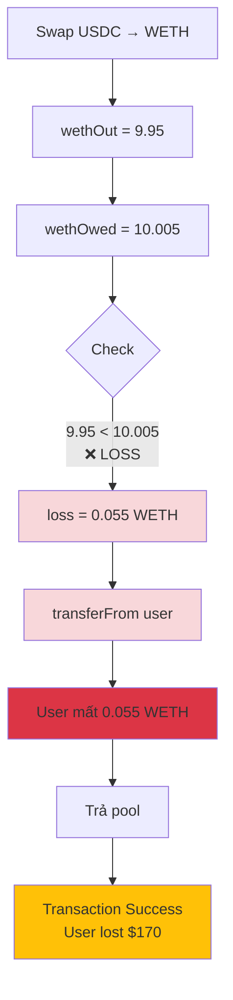
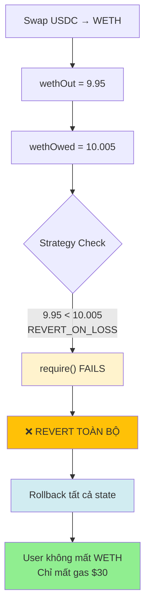

# CẢI TIẾN CONTRACT: AUTO ROLLBACK KHI LỖ

## 🎯 Ý TƯỞNG CHÍNH

Thay vì **lấy tiền từ user khi lỗ**, ta có thể **REVERT toàn bộ transaction** → User không mất gì (chỉ mất gas)!

```solidity
// ❌ CÁCH CŨ: Lấy tiền user khi lỗ
if (wethAmountOut < wethAmountIn) {
    uint loss = wethAmountIn - wethAmountOut;
    weth.transferFrom(caller, address(this), loss);  // User mất tiền!
}

// ✅ CÁCH MỚI: Revert khi lỗ
require(
    wethAmountOut >= wethAmountIn,
    "Not profitable - reverting"
);
// Transaction bị hủy → User không mất WETH!
```

---

## 🚀 PHIÊN BẢN CẢI TIẾN

### **Contract mới với Auto-Rollback:**

```solidity
// SPDX-License-Identifier: MIT
pragma solidity ^0.8.18;

import "hardhat/console.sol";
import "./interfaces/IERC20.sol";
import "@uniswap/v3-periphery/contracts/interfaces/ISwapRouter.sol";
import "@uniswap/v3-core/contracts/interfaces/IUniswapV3Pool.sol";

/**
 * @title UniswapV3FlashSwapImproved
 * @notice Contract với auto-rollback protection khi không có lời
 */
contract UniswapV3FlashSwapImproved {
    ISwapRouter constant router = ISwapRouter(0xE592427A0AEce92De3Edee1F18E0157C05861564);

    uint160 internal constant MIN_SQRT_RATIO = 4295128739;
    uint160 internal constant MAX_SQRT_RATIO =
        1461446703485210103287273052203988822378723970342;

    address private constant USDC = 0xA0b86991c6218b36c1d19D4a2e9Eb0cE3606eB48;
    address private constant WETH = 0xC02aaA39b223FE8D0A0e5C4F27eAD9083C756Cc2;

    IERC20 private constant usdc = IERC20(USDC);
    IERC20 private constant weth = IERC20(WETH);

    // ============================================
    // CẢI TIẾN 1: Thêm enum cho chiến lược
    // ============================================
    enum ProfitStrategy {
        REVERT_ON_LOSS,      // Revert nếu lỗ
        REVERT_ON_NO_PROFIT, // Revert nếu không có lời (kể cả break-even)
        REQUIRE_MIN_PROFIT,  // Yêu cầu profit tối thiểu
        ALLOW_SMALL_LOSS     // Cho phép loss nhỏ
    }

    // Strategy mặc định
    ProfitStrategy public strategy = ProfitStrategy.REVERT_ON_LOSS;

    // Profit tối thiểu (nếu dùng REQUIRE_MIN_PROFIT)
    uint public minProfitBps = 10; // 0.1% = 10 basis points

    // Loss tối đa cho phép (nếu dùng ALLOW_SMALL_LOSS)
    uint public maxLossWei = 0.01 ether; // 0.01 WETH

    // Owner để config
    address public owner;

    constructor() {
        owner = msg.sender;
    }

    // ============================================
    // CẢI TIẾN 2: Cho phép thay đổi strategy
    // ============================================
    function setStrategy(ProfitStrategy _strategy) external {
        require(msg.sender == owner, "Only owner");
        strategy = _strategy;
    }

    function setMinProfit(uint _bps) external {
        require(msg.sender == owner, "Only owner");
        minProfitBps = _bps;
    }

    function setMaxLoss(uint _maxLoss) external {
        require(msg.sender == owner, "Only owner");
        maxLossWei = _maxLoss;
    }

    // ============================================
    // FUNCTION CHÍNH
    // ============================================
    function flashSwap(
        address pool0,
        uint24 fee1,
        uint wethAmountIn
    ) external {
        bytes memory data = abi.encode(msg.sender, pool0, fee1);

        IUniswapV3Pool(pool0).swap(
            address(this),
            false,
            int(wethAmountIn),
            MAX_SQRT_RATIO - 1,
            data
        );
    }

    function _swap(
        address tokenIn,
        address tokenOut,
        uint24 fee,
        uint amountIn
    ) private returns (uint amountOut) {
        IERC20(tokenIn).approve(address(router), amountIn);

        ISwapRouter.ExactInputSingleParams memory params = ISwapRouter
            .ExactInputSingleParams({
                tokenIn: tokenIn,
                tokenOut: tokenOut,
                fee: fee,
                recipient: address(this),
                deadline: block.timestamp,
                amountIn: amountIn,
                amountOutMinimum: 0,
                sqrtPriceLimitX96: 0
            });

        amountOut = router.exactInputSingle(params);
    }

    // ============================================
    // CẢI TIẾN 3: CALLBACK VỚI ROLLBACK LOGIC
    // ============================================
    function uniswapV3SwapCallback(
        int amount0,
        int amount1,
        bytes calldata data
    ) external {
        (address caller, address pool0, uint24 fee1) = abi.decode(
            data,
            (address, address, uint24)
        );

        require(msg.sender == address(pool0), "not authorized");

        uint usdcAmountOut = uint(-amount0);
        uint wethAmountIn = uint(amount1);

        console.log("USDC received:", usdcAmountOut);
        console.log("WETH must pay:", wethAmountIn);

        // Swap USDC → WETH
        uint wethAmountOut = _swap(USDC, WETH, fee1, usdcAmountOut);

        console.log("WETH received:", wethAmountOut);

        // ============================================
        // CẢI TIẾN: ÁPDỤNG STRATEGY
        // ============================================
        _applyProfitStrategy(wethAmountOut, wethAmountIn);

        // Nếu đến đây → có lời hoặc được phép
        if (wethAmountOut >= wethAmountIn) {
            // CÓ LỜI
            uint profit = wethAmountOut - wethAmountIn;
            console.log("✅ PROFIT:", profit);

            weth.transfer(address(pool0), wethAmountIn);
            weth.transfer(caller, profit);
        } else {
            // LỖ NHƯNG ĐƯỢC PHÉP (strategy ALLOW_SMALL_LOSS)
            uint loss = wethAmountIn - wethAmountOut;
            console.log("⚠️ SMALL LOSS ALLOWED:", loss);

            weth.transferFrom(caller, address(this), loss);
            weth.transfer(address(pool0), wethAmountIn);
        }
    }

    // ============================================
    // CẢI TIẾN 4: LOGIC KIỂM TRA PROFIT
    // ============================================
    function _applyProfitStrategy(
        uint wethAmountOut,
        uint wethAmountIn
    ) private view {
        if (strategy == ProfitStrategy.REVERT_ON_LOSS) {
            // Chiến lược 1: Revert nếu lỗ
            require(
                wethAmountOut >= wethAmountIn,
                "LOSS DETECTED - Transaction reverted"
            );

        } else if (strategy == ProfitStrategy.REVERT_ON_NO_PROFIT) {
            // Chiến lược 2: Revert nếu không có lời (kể cả break-even)
            require(
                wethAmountOut > wethAmountIn,
                "NO PROFIT - Transaction reverted"
            );

        } else if (strategy == ProfitStrategy.REQUIRE_MIN_PROFIT) {
            // Chiến lược 3: Yêu cầu profit tối thiểu
            uint minProfit = (wethAmountIn * minProfitBps) / 10000;
            require(
                wethAmountOut >= wethAmountIn + minProfit,
                "PROFIT TOO SMALL - Transaction reverted"
            );

        } else if (strategy == ProfitStrategy.ALLOW_SMALL_LOSS) {
            // Chiến lược 4: Cho phép loss nhỏ
            if (wethAmountOut < wethAmountIn) {
                uint loss = wethAmountIn - wethAmountOut;
                require(
                    loss <= maxLossWei,
                    "LOSS TOO BIG - Transaction reverted"
                );
            }
        }
    }

    // ============================================
    // CẢI TIẾN 5: SIMULATE TRƯỚC KHI EXECUTE
    // ============================================
    /**
     * @notice Simulate arbitrage để check profit trước khi execute
     * @dev Call static, không tốn gas
     * @return profitable True nếu có lời
     * @return expectedProfit Profit dự kiến (hoặc loss nếu âm)
     */
    function simulateArbitrage(
        address pool0,
        uint24 fee0,
        uint24 fee1,
        uint wethAmountIn
    ) external view returns (bool profitable, int256 expectedProfit) {
        // Tính USDC nhận được từ pool0
        uint usdcAmountOut = _estimateSwapOutput(
            wethAmountIn,
            fee0,
            true // WETH -> USDC
        );

        // Tính WETH nhận lại từ pool1
        uint wethAmountOut = _estimateSwapOutput(
            usdcAmountOut,
            fee1,
            false // USDC -> WETH
        );

        // Tính WETH phải trả
        uint wethAmountOwed = wethAmountIn + (wethAmountIn * fee0) / 1000000;

        // Tính profit
        if (wethAmountOut >= wethAmountOwed) {
            profitable = true;
            expectedProfit = int256(wethAmountOut - wethAmountOwed);
        } else {
            profitable = false;
            expectedProfit = -int256(wethAmountOwed - wethAmountOut);
        }
    }

    function _estimateSwapOutput(
        uint amountIn,
        uint24 fee,
        bool /* direction */
    ) private pure returns (uint) {
        // Simplified estimation (trong thực tế cần query pool price)
        // Chỉ trừ fee
        return amountIn - (amountIn * fee) / 1000000;
    }
}
```

---

## 📊 SO SÁNH 4 STRATEGIES

### **Strategy 1: REVERT_ON_LOSS (Khuyến nghị)**

```solidity
strategy = ProfitStrategy.REVERT_ON_LOSS;

// Logic:
require(wethAmountOut >= wethAmountIn, "LOSS - Reverted");

// Kết quả:
// ✅ Profit: Transaction thành công, user nhận profit
// ⚖️ Break-even: Transaction thành công, user không lời không lỗ
// ❌ Loss: REVERT → User chỉ mất gas
```

**Use case:** An toàn nhất, không bao giờ mất vốn.

---

### **Strategy 2: REVERT_ON_NO_PROFIT (Aggressive)**

```solidity
strategy = ProfitStrategy.REVERT_ON_NO_PROFIT;

// Logic:
require(wethAmountOut > wethAmountIn, "NO PROFIT - Reverted");

// Kết quả:
// ✅ Profit: Transaction thành công
// ⚖️ Break-even: REVERT (vì không có lời)
// ❌ Loss: REVERT
```

**Use case:** Chỉ chấp nhận trade có lời, không chấp nhận break-even.

---

### **Strategy 3: REQUIRE_MIN_PROFIT (Professional)**

```solidity
strategy = ProfitStrategy.REQUIRE_MIN_PROFIT;
minProfitBps = 50;  // 0.5% minimum profit

// Logic:
uint minProfit = (wethAmountIn * 50) / 10000;  // 0.5%
require(wethAmountOut >= wethAmountIn + minProfit, "PROFIT TOO SMALL");

// Ví dụ với 10 WETH:
// minProfit = 10 * 0.005 = 0.05 WETH

// Kết quả:
// ✅ Profit > 0.05 WETH: Thành công
// ⚠️ Profit < 0.05 WETH: REVERT (profit quá nhỏ)
// ❌ Loss: REVERT
```

**Use case:** Chuyên nghiệp, chỉ trade khi profit đủ lớn để đáng giá.

---

### **Strategy 4: ALLOW_SMALL_LOSS (Testing)**

```solidity
strategy = ProfitStrategy.ALLOW_SMALL_LOSS;
maxLossWei = 0.01 ether;  // Cho phép lỗ tối đa 0.01 WETH

// Logic:
if (wethAmountOut < wethAmountIn) {
    uint loss = wethAmountIn - wethAmountOut;
    require(loss <= 0.01 ether, "LOSS TOO BIG");
}

// Kết quả:
// ✅ Profit: Thành công
// ⚠️ Loss < 0.01 WETH: Thành công (user mất tiền)
// ❌ Loss > 0.01 WETH: REVERT
```

**Use case:** Testing hoặc demo, cho phép loss nhỏ.

---

## 🎬 VÍ DỤ SỬ DỤNG

### **Deploy và config:**

```javascript
// 1. Deploy contract mới
const Contract = await ethers.getContractFactory("UniswapV3FlashSwapImproved");
const contract = await Contract.deploy();
await contract.deployed();

console.log("✅ Contract deployed:", contract.address);

// 2. Set strategy
await contract.setStrategy(0);  // 0 = REVERT_ON_LOSS
console.log("✅ Strategy set to REVERT_ON_LOSS");

// Hoặc strategy khác:
// await contract.setStrategy(1);  // REVERT_ON_NO_PROFIT
// await contract.setStrategy(2);  // REQUIRE_MIN_PROFIT
// await contract.setStrategy(3);  // ALLOW_SMALL_LOSS

// 3. Config thêm (nếu dùng strategy 2 hoặc 3)
await contract.setMinProfit(50);      // 0.5% minimum
await contract.setMaxLoss(parseEther("0.01"));  // 0.01 WETH max loss
```

---

### **Simulate trước khi execute:**

```javascript
// BƯỚC 1: Simulate để check profit
const [profitable, expectedProfit] = await contract.simulateArbitrage(
    pool0,
    500,   // fee0 = 0.05%
    3000,  // fee1 = 0.3%
    parseEther("10")  // 10 WETH
);

console.log("Profitable:", profitable);
console.log("Expected profit:", formatEther(expectedProfit), "WETH");

// BƯỚC 2: Chỉ execute nếu profitable
if (profitable) {
    console.log("✅ Executing arbitrage...");

    const tx = await contract.flashSwap(
        pool0,
        3000,
        parseEther("10")
    );

    await tx.wait();
    console.log("✅ Arbitrage completed with profit!");

} else {
    console.log("❌ Not profitable - skipping");
    console.log("Would lose:", formatEther(expectedProfit.abs()), "WETH");
}
```

---

### **So sánh kết quả các strategy:**

```javascript
// Test với các tình huống khác nhau
const scenarios = [
    { pool1Price: 2940, name: "Big Profit" },
    { pool1Price: 2990, name: "Small Profit" },
    { pool1Price: 3010, name: "Break-even" },
    { pool1Price: 3005, name: "Small Loss" },
    { pool1Price: 3050, name: "Big Loss" }
];

for (const scenario of scenarios) {
    console.log(`\n━━━━━━ Testing: ${scenario.name} ━━━━━━`);

    try {
        // Strategy 1: REVERT_ON_LOSS
        await contract.setStrategy(0);
        await contract.flashSwap(pool0, 3000, parseEther("10"));
        console.log("✅ REVERT_ON_LOSS: Success");

    } catch (e) {
        console.log("❌ REVERT_ON_LOSS: Reverted -", e.reason);
    }

    try {
        // Strategy 2: REVERT_ON_NO_PROFIT
        await contract.setStrategy(1);
        await contract.flashSwap(pool0, 3000, parseEther("10"));
        console.log("✅ REVERT_ON_NO_PROFIT: Success");

    } catch (e) {
        console.log("❌ REVERT_ON_NO_PROFIT: Reverted -", e.reason);
    }

    try {
        // Strategy 3: REQUIRE_MIN_PROFIT (0.5%)
        await contract.setStrategy(2);
        await contract.setMinProfit(50);
        await contract.flashSwap(pool0, 3000, parseEther("10"));
        console.log("✅ REQUIRE_MIN_PROFIT: Success");

    } catch (e) {
        console.log("❌ REQUIRE_MIN_PROFIT: Reverted -", e.reason);
    }
}
```

**Output mẫu:**

```
━━━━━━ Testing: Big Profit ━━━━━━
✅ REVERT_ON_LOSS: Success
✅ REVERT_ON_NO_PROFIT: Success
✅ REQUIRE_MIN_PROFIT: Success

━━━━━━ Testing: Small Profit ━━━━━━
✅ REVERT_ON_LOSS: Success
✅ REVERT_ON_NO_PROFIT: Success
❌ REQUIRE_MIN_PROFIT: Reverted - PROFIT TOO SMALL

━━━━━━ Testing: Break-even ━━━━━━
✅ REVERT_ON_LOSS: Success
❌ REVERT_ON_NO_PROFIT: Reverted - NO PROFIT
❌ REQUIRE_MIN_PROFIT: Reverted - PROFIT TOO SMALL

━━━━━━ Testing: Small Loss ━━━━━━
❌ REVERT_ON_LOSS: Reverted - LOSS DETECTED
❌ REVERT_ON_NO_PROFIT: Reverted - NO PROFIT
❌ REQUIRE_MIN_PROFIT: Reverted - PROFIT TOO SMALL

━━━━━━ Testing: Big Loss ━━━━━━
❌ REVERT_ON_LOSS: Reverted - LOSS DETECTED
❌ REVERT_ON_NO_PROFIT: Reverted - NO PROFIT
❌ REQUIRE_MIN_PROFIT: Reverted - PROFIT TOO SMALL
```

---

## 🎯 LỢI ÍCH CỦA ROLLBACK

### **So sánh Contract cũ vs mới:**

| Tình huống | Contract cũ | Contract mới (REVERT_ON_LOSS) |
|------------|-------------|-------------------------------|
| **Profit +0.1 WETH** | ✅ User nhận +0.1 WETH | ✅ User nhận +0.1 WETH |
| **Break-even** | ⚖️ User +0 WETH | ⚖️ User +0 WETH |
| **Loss -0.05 WETH** | ❌ User mất -0.05 WETH<br/>+ gas $30 | ✅ REVERT<br/>User chỉ mất gas $30 |
| **Big Loss -0.3 WETH** | ❌❌ User mất -0.3 WETH ($930)<br/>+ gas $30 | ✅ REVERT<br/>User chỉ mất gas $30 |

**Kết luận:** Contract mới **AN TOÀN HƠN NHIỀU**!

---

## 📈 BẢNG QUYẾT ĐỊNH STRATEGY

| Mục đích | Strategy nên dùng | Config |
|----------|-------------------|--------|
| **Bảo vệ vốn tối đa** | `REVERT_ON_LOSS` | Không cần config thêm |
| **Chỉ trade profitable** | `REVERT_ON_NO_PROFIT` | Không cần config thêm |
| **Professional bot** | `REQUIRE_MIN_PROFIT` | `minProfitBps = 50` (0.5%) |
| **Testing/Demo** | `ALLOW_SMALL_LOSS` | `maxLossWei = 0.01 ether` |

---

## ⚡ FLOW SO SÁNH

### **Contract cũ - Khi lỗ:**



### **Contract mới - Khi lỗ:**



---

## 🔒 BẢO MẬT & GAS

### **Gas cost so sánh:**

```javascript
// Contract cũ (có lỗ):
Gas used: ~350,000
- Flash swap: 150k
- Swap operations: 150k
- transferFrom (lấy từ user): 30k
- transfer (trả pool): 20k
Total: ~350k gas
Cost: 350k × 30 gwei × $3100 = ~$32.55

User mất: 0.055 WETH ($170) + $32 gas = $202 ❌


// Contract mới (revert):
Gas used: ~250,000 (REVERT sớm)
- Flash swap: 150k
- Swap operations: 150k
- require() fails và revert
Total: ~250k gas (ít hơn!)
Cost: 250k × 30 gwei × $3100 = ~$23.25

User mất: $0 (WETH) + $23 gas = $23 ✅
Tiết kiệm: $202 - $23 = $179!
```

---

## 📝 CHECKLIST ĐỂ IMPLEMENT

```markdown
✅ 1. Deploy contract mới (UniswapV3FlashSwapImproved)
✅ 2. Set strategy (khuyến nghị: REVERT_ON_LOSS)
✅ 3. Test với simulation trước
✅ 4. Approve WETH (ít hơn so với contract cũ)
✅ 5. Execute arbitrage
✅ 6. Monitor và adjust strategy nếu cần
```

---

## 🎉 TÓM TẮT

### **Cải tiến chính:**

1. **Auto-rollback khi lỗ** → Không mất vốn
2. **4 strategies linh hoạt** → Tùy chỉnh theo nhu cầu
3. **Simulate function** → Check profit trước khi execute
4. **Tiết kiệm gas** → Revert sớm, không execute đến cuối
5. **An toàn hơn nhiều** → User không bao giờ mất vốn (chỉ mất gas)

### **Code pattern:**

```solidity
// Đơn giản nhất:
require(
    wethAmountOut >= wethAmountIn,
    "Not profitable - reverting"
);

// → Nếu không profitable → REVERT
// → User chỉ mất gas, không mất WETH!
```

### **Lợi ích lớn nhất:**

```
Contract cũ: Loss -$170 + gas $30 = -$200 ❌
Contract mới: Loss $0 + gas $23 = -$23 ✅

Tiết kiệm: $177 mỗi trade fail!
```

---

**File này hướng dẫn đầy đủ cách cải tiến contract để ROLLBACK khi lỗ!** 🛡️✨

### **Sử dụng:**

```javascript
// 1. Deploy
const contract = await deploy("UniswapV3FlashSwapImproved");

// 2. Set strategy an toàn nhất
await contract.setStrategy(0);  // REVERT_ON_LOSS

// 3. Execute yên tâm
await contract.flashSwap(pool0, fee1, amount);

// → Nếu lỗ → Auto revert → Chỉ mất gas! 🎉
```
