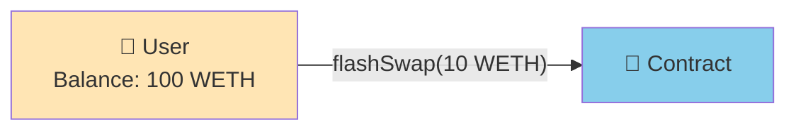
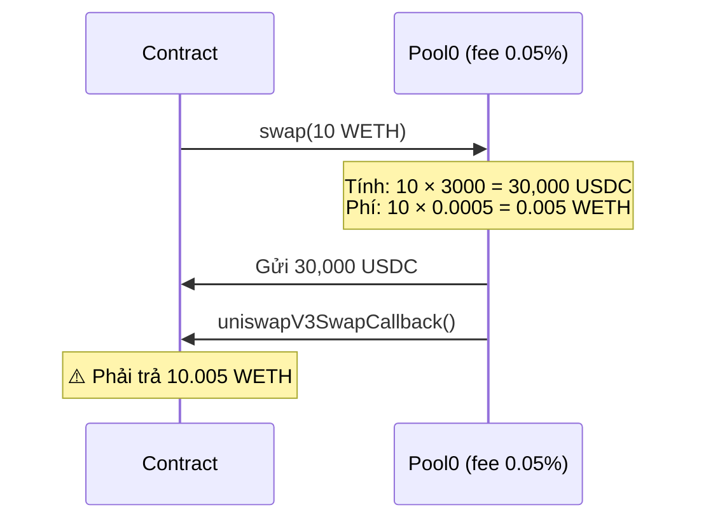
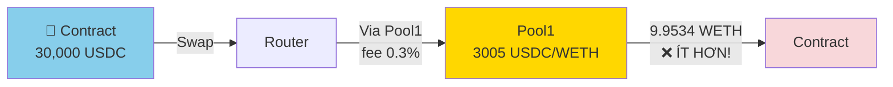
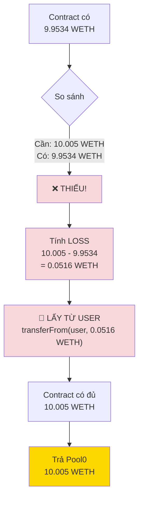
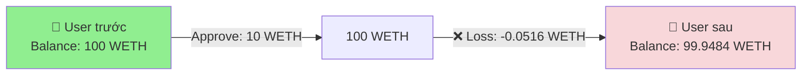
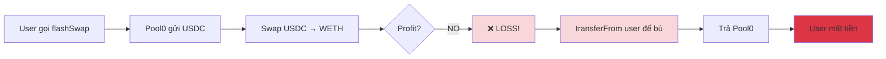

# TRƯỜNG HỢP TRADE KHÔNG CÓ LỜI (LOSS SCENARIO)

## ⚠️ KHI NÀO XẢY RA LOSS?

### **3 Nguyên nhân chính:**

1. **Chênh lệch giá quá nhỏ** - Không đủ để cover phí
2. **Bị frontrun/sandwiched** - Bot MEV đánh trước
3. **Price impact lớn** - Liquidity pool nhỏ, slippage cao

---

## 📉 VÍ DỤ CỤ THỂ: LOSS SCENARIO

### **Tình huống:**

```javascript
// Giá pools:
Pool 0 (WETH/USDC, fee 0.05%): 1 WETH = 3000 USDC
Pool 1 (WETH/USDC, fee 0.3%):  1 WETH = 3005 USDC  ← Chênh quá ít!

// Chênh lệch:
3005 - 3000 = 5 USDC (chỉ 0.17%)

// Tổng phí:
0.05% + 0.3% = 0.35%

// ⚠️ VẤN ĐỀ: 0.17% < 0.35%
→ CHẮC CHẮN BỊ LỖ!
```

---

## 🔴 FLOW CHI TIẾT KHI BỊ LỖ

### **STEP 1: User vẫn gọi flashSwap như bình thường**

```javascript
// User không biết sẽ lỗ (hoặc tính toán sai)
await contract.flashSwap(
    pool0,  // 0x88e6A0c2dDD26FEEb64F039a2c41296FcB3f5640
    3000,   // fee1 = 0.3%
    ethers.utils.parseEther("10")  // 10 WETH
);
```



**Console:**
```
🟡 User initiates flashSwap with 10 WETH
⚠️  Warning: Price difference too small!
```

---

### **STEP 2: Pool0 vẫn gửi USDC và tính phí**

```javascript
// Pool0 tính toán:
Vay: 10 WETH
Giá Pool0: 3000 USDC/WETH
Phí: 0.05%

→ Pool0 gửi: 10 × 3000 = 30,000 USDC
→ Phải trả: 10 × (1 + 0.0005) = 10.005 WETH
```



**Console:**
```
📥 STEP 2: Received from Pool0
   USDC received: 30,000
   WETH must pay: 10.005
```

---

### **STEP 3: Swap USDC → WETH qua Pool1 (giá kém hơn)**

```javascript
// Swap 30,000 USDC → WETH qua Pool1
Giá Pool1: 3005 USDC/WETH (cao hơn Pool0!)
Phí: 0.3%

Tính toán:
WETH trước phí = 30,000 ÷ 3005 = 9.9834 WETH
WETH sau phí   = 9.9834 × (1 - 0.003) = 9.9834 × 0.997 = 9.9534 WETH

→ wethAmountOut = 9.9534 WETH
```



**Console:**
```
🔄 STEP 3: Swap USDC → WETH via Pool1
   USDC input: 30,000
   WETH output: 9.9534 WETH
   ❌ Less than needed!
```

---

### **STEP 4: Phát hiện LOSS và xử lý**

```javascript
// Trong uniswapV3SwapCallback:

wethAmountOut = 9.9534 WETH   // Nhận từ Pool1
wethAmountIn = 10.005 WETH    // Phải trả Pool0

if (wethAmountOut >= wethAmountIn) {
    // Có lời - Không vào nhánh này!
} else {
    // ❌ BỊ LỖ - VÀO NHÁNH NÀY!

    loss = wethAmountIn - wethAmountOut
        = 10.005 - 9.9534
        = 0.0516 WETH  // ≈ $159.96

    console.log("❌ LOSS DETECTED:", loss, "WETH");

    // ⚠️ LẤY WETH TỪ USER ĐỂ BÙ LOSS
    weth.transferFrom(caller, address(this), loss);

    // Trả đủ số nợ cho Pool0
    weth.transfer(pool0, wethAmountIn);
}
```



**Console:**
```
❌ STEP 4: LOSS DETECTED!
   Required: 10.005 WETH
   Received: 9.9534 WETH
   ━━━━━━━━━━━━━━━━━━━━
   💸 LOSS: 0.0516 WETH (≈ $159.96)

   ⚠️  Taking 0.0516 WETH from user to cover loss...
   ✓ Transferred 0.0516 WETH from user
   ✓ Paying back Pool0: 10.005 WETH
```

---

### **STEP 5: User balance giảm**



**Console:**
```
💔 TRANSACTION COMPLETED WITH LOSS

User balance before: 100.0000 WETH
User balance after:  99.9484 WETH
━━━━━━━━━━━━━━━━━━━━━━━━━━━━━━
User lost: 0.0516 WETH (≈ $159.96 USD)
```

---

## 📊 BẢNG SO SÁNH PROFIT VS LOSS

| Scenario | Pool0 Price | Pool1 Price | Chênh lệch | WETH Out | WETH Need | Result | User P&L |
|----------|-------------|-------------|------------|----------|-----------|--------|----------|
| **PROFIT** | 3000 | 2940 | 60 (2%) | 10.1735 | 10.005 | ✅ +0.1685 WETH | **+$521.55** |
| Break-even | 3000 | 3010 | 10 (0.33%) | 10.005 | 10.005 | ⚖️ 0 WETH | $0 |
| **LOSS** | 3000 | 3005 | 5 (0.17%) | 9.9534 | 10.005 | ❌ -0.0516 WETH | **-$159.96** |
| **BIG LOSS** | 3000 | 3020 | -20 (-0.67%) | 9.9305 | 10.005 | ❌ -0.0745 WETH | **-$230.95** |

---

## 💻 CODE CHI TIẾT PHẦN XỬ LÝ LOSS

### **Trong Smart Contract:**

```solidity
// UniswapV3Arbitrage.sol - uniswapV3SwapCallback function

function uniswapV3SwapCallback(
    int amount0,
    int amount1,
    bytes calldata data
) external {
    // ... decode data ...

    uint usdcAmountOut = uint(-amount0);  // 30,000 USDC
    uint wethAmountIn = uint(amount1);     // 10.005 WETH

    // Swap USDC → WETH qua Pool1
    uint wethAmountOut = _swap(USDC, WETH, fee1, usdcAmountOut);
    // wethAmountOut = 9.9534 WETH (ít hơn 10.005!)

    console.log("WETH received:", wethAmountOut);
    console.log("WETH needed:", wethAmountIn);

    if (wethAmountOut >= wethAmountIn) {
        // ✅ CASE 1: CÓ LỜI
        uint profit = wethAmountOut - wethAmountIn;
        console.log("✅ PROFIT:", profit);

        weth.transfer(address(pool0), wethAmountIn);
        weth.transfer(caller, profit);

    } else {
        // ❌ CASE 2: BỊ LỖ (vào đây!)
        uint loss = wethAmountIn - wethAmountOut;
        // loss = 10.005 - 9.9534 = 0.0516 WETH

        console.log("❌ LOSS:", loss);

        // ⚠️ QUAN TRỌNG: Lấy WETH từ user để bù loss
        // User PHẢI approve đủ số lượng này trước!
        bool success = weth.transferFrom(caller, address(this), loss);
        require(success, "User must cover the loss");

        // Giờ contract có đủ WETH để trả nợ
        // Contract có: 9.9534 + 0.0516 = 10.005 WETH
        weth.transfer(address(pool0), wethAmountIn);

        // User mất 0.0516 WETH!
    }
}
```

### **Flow trong code:**

```mermaid
graph TD
    Start[Callback được gọi] --> A[usdcAmountOut = 30,000<br/>wethAmountIn = 10.005]
    A --> B[Swap USDC → WETH<br/>wethAmountOut = 9.9534]
    B --> C{wethAmountOut >= wethAmountIn?}

    C -->|YES: 9.9534 >= 10.005<br/>❌ FALSE| D[loss = 10.005 - 9.9534<br/>= 0.0516 WETH]

    D --> E["⚠️ transferFrom(user, loss)"]

    E --> F{Success?}

    F -->|YES| G[Contract có 10.005 WETH]
    F -->|NO| H[❌ REVERT<br/>"User must cover loss"]

    G --> I[transfer(pool0, 10.005)]
    I --> J[✓ Hoàn tất<br/>User mất 0.0516 WETH]

    style C fill:#87CEEB
    style D fill:#f8d7da
    style E fill:#f8d7da
    style H fill:#dc3545
    style J fill:#ffc107
```

---

## ⚠️ ĐIỀU KIỆN ĐỂ GIAO DỊCH THÀNH CÔNG (KỂ CẢ KHI LỖ)

### **User PHẢI approve đủ WETH trước:**

```javascript
// ❌ SAI: Chỉ approve đúng số vay
await weth.approve(contract.address, ethers.utils.parseEther("10"));

// Nếu lỗ 0.0516 WETH → transferFrom sẽ FAIL!
// → Transaction bị REVERT!


// ✅ ĐÚNG: Approve nhiều hơn để cover loss có thể xảy ra
const amountToVay = ethers.utils.parseEther("10");
const bufferForLoss = ethers.utils.parseEther("1");  // 1 WETH buffer

await weth.approve(
    contract.address,
    amountToVay.add(bufferForLoss)  // 11 WETH
);

// Giờ nếu lỗ < 1 WETH thì vẫn OK
```

**Nếu không approve đủ:**

```
Transaction sẽ REVERT với lỗi:
❌ Error: ERC20: transfer amount exceeds allowance
❌ Reason: User must cover the loss

→ User KHÔNG mất tiền (vì transaction fail)
→ Nhưng mất gas fee!
```

---

## 🧮 TÍNH TOÁN LOSS TRƯỚC KHI TRADE

### **Công thức ước tính:**

```javascript
// 1. Tính số USDC nhận được từ Pool0
usdcOut = wethAmount × pricePool0 × (1 - feePool0)
        = 10 × 3000 × 0.9995
        = 29,985 USDC

// 2. Tính số WETH nhận lại từ Pool1
wethOut = usdcOut ÷ pricePool1 × (1 - feePool1)
        = 29,985 ÷ 3005 × 0.997
        = 9.9534 WETH

// 3. Tính số WETH phải trả Pool0
wethOwed = wethAmount × (1 + feePool0)
         = 10 × 1.0005
         = 10.005 WETH

// 4. Profit hoặc Loss
result = wethOut - wethOwed
       = 9.9534 - 10.005
       = -0.0516 WETH  ❌ LOSS!

// Nếu result < 0 → KHÔNG NÊN TRADE!
```

### **Script kiểm tra trước:**

```javascript
// check-profitability.js
async function checkProfitability(wethAmount, pool0Price, pool1Price, fee0, fee1) {
    // Tính USDC out
    const usdcOut = wethAmount * pool0Price * (1 - fee0);

    // Tính WETH out
    const wethOut = (usdcOut / pool1Price) * (1 - fee1);

    // Tính WETH owed
    const wethOwed = wethAmount * (1 + fee0);

    // Tính profit/loss
    const result = wethOut - wethOwed;

    console.log("━━━━━━━━━━━━━━━━━━━━━━━━━━━");
    console.log("PROFITABILITY CHECK");
    console.log("━━━━━━━━━━━━━━━━━━━━━━━━━━━");
    console.log("Input:", wethAmount, "WETH");
    console.log("USDC from Pool0:", usdcOut);
    console.log("WETH from Pool1:", wethOut);
    console.log("WETH owed to Pool0:", wethOwed);
    console.log("━━━━━━━━━━━━━━━━━━━━━━━━━━━");

    if (result > 0) {
        console.log("✅ PROFIT:", result, "WETH");
        console.log("≈ $", (result * pool0Price).toFixed(2));
        return true;
    } else if (result === 0) {
        console.log("⚖️  BREAK EVEN");
        return false;
    } else {
        console.log("❌ LOSS:", Math.abs(result), "WETH");
        console.log("≈ -$", (Math.abs(result) * pool0Price).toFixed(2));
        console.log("⚠️  DO NOT TRADE!");
        return false;
    }
}

// Test
checkProfitability(
    10,      // 10 WETH
    3000,    // Pool0: 3000 USDC/WETH
    3005,    // Pool1: 3005 USDC/WETH
    0.0005,  // Pool0 fee: 0.05%
    0.003    // Pool1 fee: 0.3%
);

// Output:
// ❌ LOSS: 0.0516 WETH
// ≈ -$154.8
// ⚠️  DO NOT TRADE!
```

---

## 🛡️ BẢO VỆ KHỎI LOSS

### **1. Check giá trước khi trade:**

```solidity
// Thêm vào contract:
function checkProfitability(
    address pool0,
    address pool1,
    uint wethAmount
) public view returns (int256 estimatedProfit) {
    // Tính toán profit ước tính
    // Return số âm nếu loss
}

// User gọi trước:
int256 profit = contract.checkProfitability(pool0, pool1, 10 ether);
if (profit > 0) {
    // Mới execute
    contract.flashSwap(...);
}
```

### **2. Set minimum profit threshold:**

```solidity
// Trong contract callback:
uint wethAmountOut = _swap(USDC, WETH, fee1, usdcAmountOut);

// ⚠️ REVERT nếu lỗ quá nhiều
require(
    wethAmountOut >= wethAmountIn,
    "Arbitrage not profitable"
);

// Hoặc cho phép loss nhỏ:
uint maxAcceptableLoss = 0.01 ether;  // Chấp nhận lỗ tối đa 0.01 WETH

if (wethAmountOut < wethAmountIn) {
    uint loss = wethAmountIn - wethAmountOut;
    require(
        loss <= maxAcceptableLoss,
        "Loss exceeds threshold"
    );
}
```

### **3. Slippage protection:**

```solidity
// Thêm parameter minWethOut
function flashSwap(
    address pool0,
    uint24 fee1,
    uint wethAmountIn,
    uint minWethOut  // ← Thêm tham số này
) external {
    bytes memory data = abi.encode(
        msg.sender,
        pool0,
        fee1,
        minWethOut  // Encode thêm
    );
    // ...
}

// Trong callback:
(address caller, address pool0, uint24 fee1, uint minWethOut) = abi.decode(data, ...);

uint wethAmountOut = _swap(USDC, WETH, fee1, usdcAmountOut);

// ⚠️ REVERT nếu nhận ít hơn expected
require(
    wethAmountOut >= minWethOut,
    "Slippage too high"
);
```

---

## 📉 WORST CASE SCENARIO

### **Tình huống tệ nhất:**

```javascript
// Pool bị manipulated hoặc front-run
Pool0: 3000 USDC/WETH (vay tại đây)
Pool1: 3100 USDC/WETH (giá CAO hơn nhiều!)

// Tính toán:
Vay: 10 WETH → Nhận: 30,000 USDC
Swap: 30,000 USDC ÷ 3100 × 0.997 = 9.6484 WETH

Loss = 10.005 - 9.6484 = 0.3566 WETH
     ≈ $1,069.8 USD ❌❌❌

// User mất $1,070 trong 1 transaction!
```

**Phòng tránh:**

```javascript
// 1. Kiểm tra giá onchain trước
const currentPrice = await getPoolPrice(pool1);
if (currentPrice > expectedPrice * 1.01) {  // Cho phép lệch 1%
    throw new Error("Price moved too much!");
}

// 2. Dùng private mempool (Flashbots)
const tx = await flashbotsProvider.sendPrivateTransaction(bundle);

// 3. Set deadline ngắn
deadline: block.timestamp + 60  // Chỉ 60 giây
```

---

## 🎯 TÓM TẮT

### **Khi trade BỊ LỖ:**



### **3 điều QUAN TRỌNG:**

1. **User PHẢI approve đủ** - Nếu không transaction sẽ REVERT
2. **Contract tự động lấy từ user** - Không cần user làm gì thêm
3. **Kiểm tra TRƯỚC khi trade** - Dùng script tính toán profit/loss

### **Code pattern:**

```solidity
if (wethAmountOut >= wethAmountIn) {
    // ✅ PROFIT: Gửi profit cho user
    profit = wethAmountOut - wethAmountIn;
    weth.transfer(caller, profit);
} else {
    // ❌ LOSS: Lấy từ user để bù
    loss = wethAmountIn - wethAmountOut;
    weth.transferFrom(caller, address(this), loss);
}
// Luôn trả đủ cho pool
weth.transfer(pool0, wethAmountIn);
```

---

**File này giải thích đầy đủ về trường hợp trade KHÔNG CÓ LỜI!** ⚠️💸
