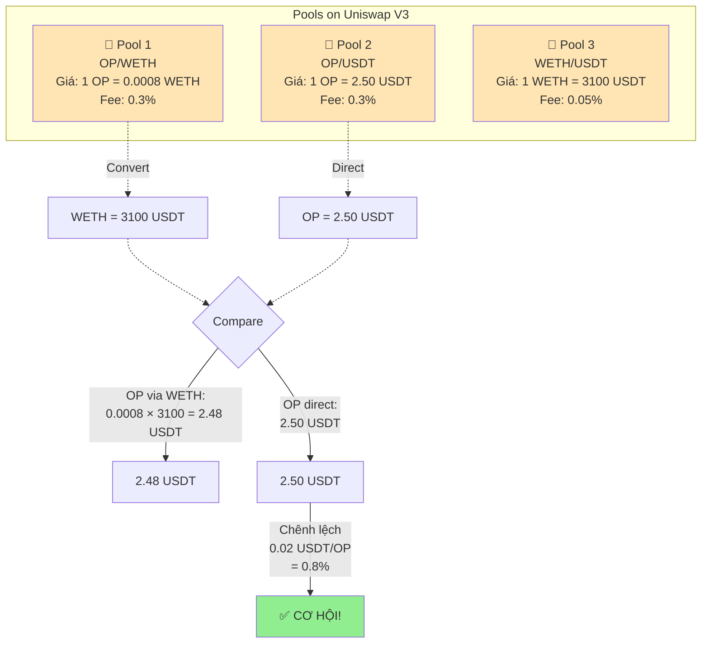
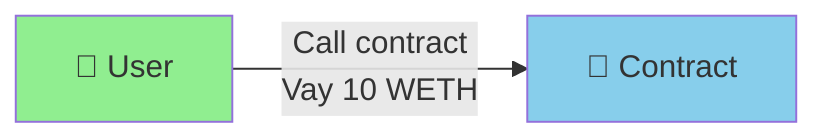
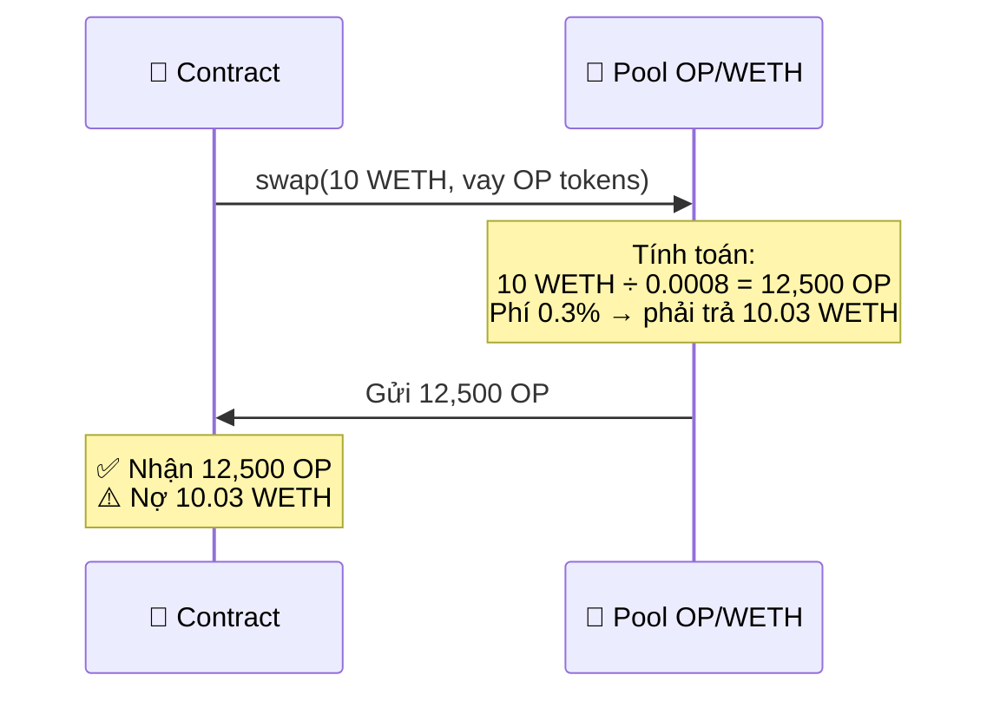
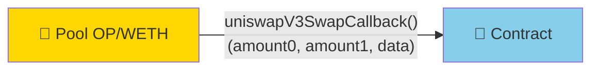
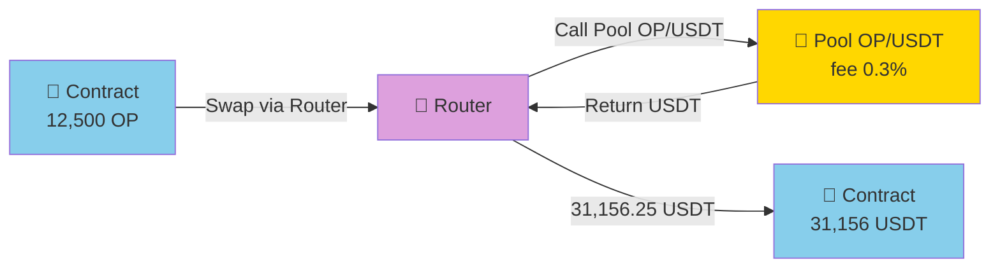
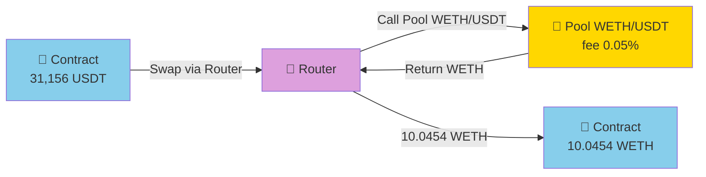
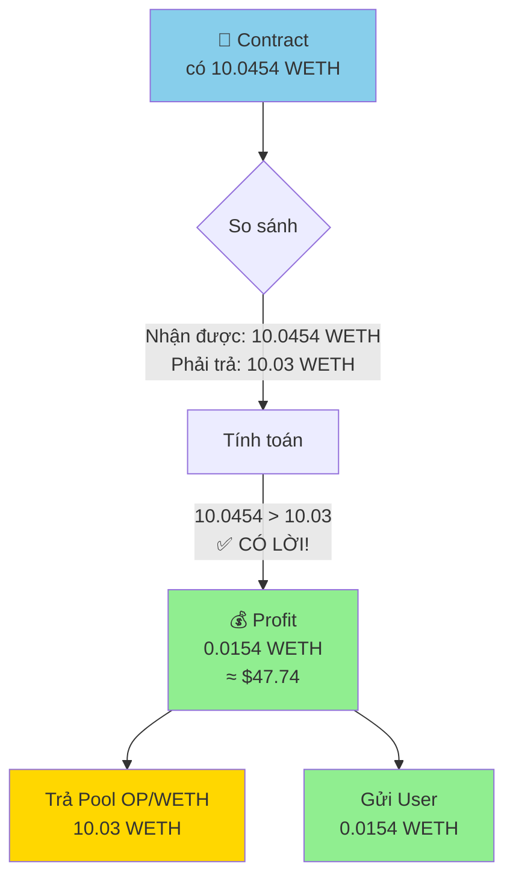
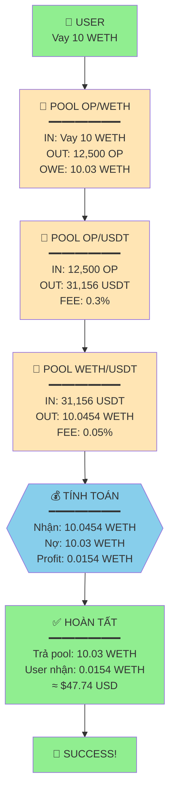

# FLOW ĐƠN GIẢN: ARBITRAGE TOKEN OP

## 🎯 Ý TƯỞNG CHÍNH

```
Mua OP giá RẺ → Bán OP giá CAO → Kiếm lời chênh lệch!
```

**Nhưng không cần vốn!** Dùng flash loan để vay rồi trả trong 1 transaction.

---

## 🔺 3 POOLS TẠO CƠ HỘI



---

## 🚀 FLOW 6 BƯỚC ĐƠN GIẢN

### **🎬 BƯỚC 1: User khởi động**

```javascript
// User gọi contract với tham số:
flashSwapTriangular({
    poolWETH_OP: "0x...",    // Pool OP/WETH
    feeOP_USDT: 3000,        // 0.3%
    feeWETH_USDT: 500,       // 0.05%
    wethAmount: 10 WETH      // Vay 10 WETH
})
```



**Console:**
```
🟢 User initiates arbitrage with 10 WETH
```

---

### **💸 BƯỚC 2: Vay WETH, nhận OP**

Contract gọi pool OP/WETH để vay:



**Tính toán:**
```
Vay: 10 WETH
Giá: 1 OP = 0.0008 WETH → 1 WETH = 1250 OP

Contract nhận: 10 × 1250 = 12,500 OP
Contract nợ:   10 × (1 + 0.003) = 10.03 WETH
```

**Console:**
```
💰 STEP 2: Borrowed from OP/WETH pool
   ✓ Received: 12,500 OP tokens
   ⚠ Must repay: 10.03 WETH
```

---

### **🔄 BƯỚC 3: Pool gọi callback**



**Dữ liệu nhận được:**
```javascript
amount0 = -12,500 OP   // Âm = contract nhận
amount1 = +10.03 WETH  // Dương = contract phải trả

// Contract decode:
opAmount = 12,500 OP
wethOwed = 10.03 WETH
```

**Console:**
```
📞 STEP 3: Callback received
   Data: -12,500 OP (received), +10.03 WETH (owed)
```

---

### **🔁 BƯỚC 4: Swap OP → USDT**

Contract swap 12,500 OP → USDT qua pool OP/USDT:



**Tính toán:**
```
Input: 12,500 OP
Giá: 1 OP = 2.50 USDT
Fee: 0.3%

USDT trước phí = 12,500 × 2.50 = 31,250 USDT
USDT sau phí   = 31,250 × 0.997 = 31,156.25 USDT

✅ Nhận: 31,156.25 USDT
```

**Console:**
```
🔵 STEP 4: Swap OP → USDT
   Input: 12,500 OP
   Output: 31,156.25 USDT
   Fee: 0.3% (93.75 USDT)
```

---

### **🔁 BƯỚC 5: Swap USDT → WETH**

Contract swap USDT → WETH qua pool WETH/USDT:



**Tính toán:**
```
Input: 31,156.25 USDT
Giá: 1 WETH = 3100 USDT
Fee: 0.05%

WETH trước phí = 31,156.25 ÷ 3100 = 10.0504 WETH
WETH sau phí   = 10.0504 × 0.9995 = 10.0454 WETH

✅ Nhận: 10.0454 WETH
```

**Console:**
```
🟡 STEP 5: Swap USDT → WETH
   Input: 31,156.25 USDT
   Output: 10.0454 WETH
   Fee: 0.05% (0.005 WETH)
```

---

### **💰 BƯỚC 6: Trả nợ & Nhận profit**



**Code trong contract:**
```javascript
// So sánh
wethReceived = 10.0454 WETH
wethOwed = 10.03 WETH

if (wethReceived > wethOwed) {
    profit = wethReceived - wethOwed
          = 10.0454 - 10.03
          = 0.0154 WETH

    // Trả nợ
    weth.transfer(poolWETH_OP, 10.03 WETH)

    // Gửi profit
    weth.transfer(user, 0.0154 WETH)
}
```

**Console:**
```
✅ STEP 6: Calculate profit
   Received: 10.0454 WETH
   Must pay: 10.03 WETH
   ━━━━━━━━━━━━━━━━━━━━
   💰 PROFIT: 0.0154 WETH

   ✓ Paid pool: 10.03 WETH
   ✓ Sent to user: 0.0154 WETH (≈ $47.74 USD)

🎉 ARBITRAGE COMPLETED SUCCESSFULLY!
```

---

## 📊 TỔNG QUAN TOÀN BỘ FLOW



---

## 💹 TRACKING BALANCE

| Step | Action | OP Balance | USDT Balance | WETH Balance | Notes |
|------|--------|------------|--------------|--------------|-------|
| 0 | Start | 0 | 0 | 0 | Contract rỗng |
| 1 | Vay từ Pool1 | **+12,500** | 0 | 0 | Nợ 10.03 WETH |
| 2 | Swap OP→USDT | 0 | **+31,156** | 0 | - |
| 3 | Swap USDT→WETH | 0 | 0 | **+10.0454** | - |
| 4 | Trả nợ Pool1 | 0 | 0 | 10.0454 - 10.03 | Trả 10.03 |
| 5 | Gửi User | 0 | 0 | **0** | Gửi 0.0154 cho User |
| ✅ | **User nhận** | - | - | **+0.0154** | **Profit: $47.74** |

---

## 🎯 CALL FUNCTION VỚI THAM SỐ THỰC TẾ

### **JavaScript/TypeScript:**

```javascript
const { ethers } = require("ethers");

// Setup contract
const contract = new ethers.Contract(
    CONTRACT_ADDRESS,
    ABI,
    signer
);

// Tham số arbitrage
const params = {
    poolWETH_OP: "0x68F5C0A2DE713a54991E01858Fd27a3832401849",  // Pool OP/WETH (ví dụ)
    tokenIntermediate: "0x4200000000000000000000000000000000000042",  // OP token
    feeOP_USDT: 3000,     // 0.3%
    feeWETH_USDT: 500,    // 0.05%
    wethAmount: ethers.utils.parseEther("10")  // 10 WETH
};

// CALL FUNCTION
const tx = await contract.flashSwapTriangular(params);
await tx.wait();

console.log("✅ Arbitrage completed!");
```

### **Solidity:**

```solidity
// Call trực tiếp từ contract khác hoặc EOA
IArbitrage(contractAddress).flashSwapTriangular(
    ArbitrageParams({
        poolWETH_OP: 0x68F5C0A2DE713a54991E01858Fd27a3832401849,
        tokenIntermediate: 0x4200000000000000000000000000000000000042,
        feeOP_USDT: 3000,
        feeWETH_USDT: 500,
        wethAmount: 10 * 10**18  // 10 WETH in wei
    })
);
```

---

## 📈 ROI CALCULATION

```
Investment: 0 WETH (dùng flash loan!)
Gas cost: ~$30 (350k gas × 30 gwei)
Profit: 0.0154 WETH = $47.74

Net profit: $47.74 - $30 = $17.74

ROI: ∞ (vì không cần vốn ban đầu!)
Profit margin: $17.74 / $47.74 = 37% (sau trừ gas)
```

**Với số lượng lớn hơn:**

```
Amount: 100 WETH
Profit: 0.154 WETH = $477.4
Gas cost: ~$30
Net profit: $447.4

→ Tỷ lệ profit/gas tốt hơn nhiều!
```

---

## ⚡ TÓM TẮT 1 PHÚT

### **Điều kiện cần:**
```
✅ OP/WETH pool: Giá 1 OP = 0.0008 WETH
✅ OP/USDT pool: Giá 1 OP = 2.50 USDT
✅ WETH/USDT pool: Giá 1 WETH = 3100 USDT

Tính giá OP qua 2 routes:
Route 1 (via WETH): 0.0008 × 3100 = 2.48 USDT
Route 2 (direct): 2.50 USDT

Chênh lệch: 2.50 - 2.48 = 0.02 USDT (0.8%)
```

### **Flow đơn giản:**
```
WETH → OP → USDT → WETH
10 → 12,500 → 31,156 → 10.0454

Profit: 0.0454 - 0.03 (phí) = 0.0154 WETH ✅
```

### **1 lệnh duy nhất:**
```javascript
await contract.flashSwapTriangular({
    poolWETH_OP,
    feeOP_USDT: 3000,
    feeWETH_USDT: 500,
    wethAmount: "10 WETH"
});

// → Nhận: 0.0154 WETH ($47.74) 🎉
```

---

**VẬY LÀ XONG! Arbitrage OP token đơn giản và có lời!** 🚀💰
