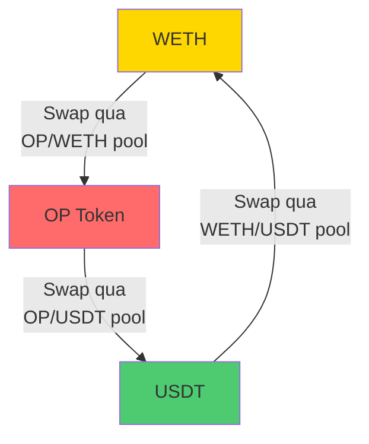
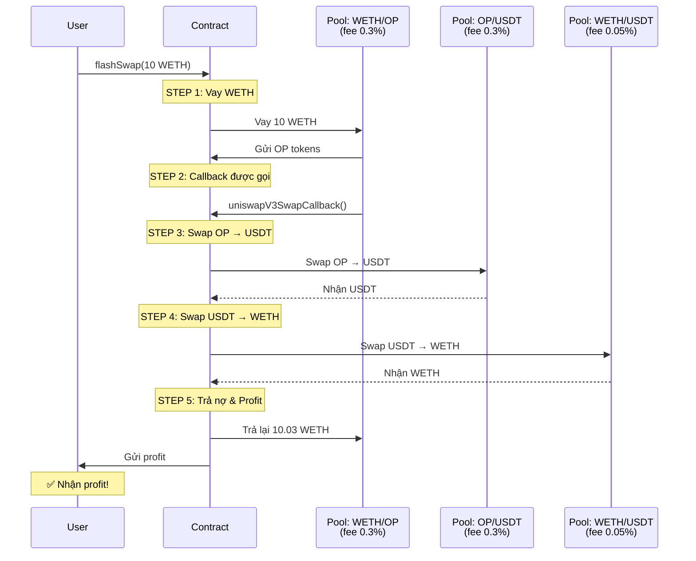
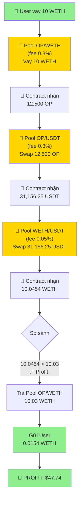
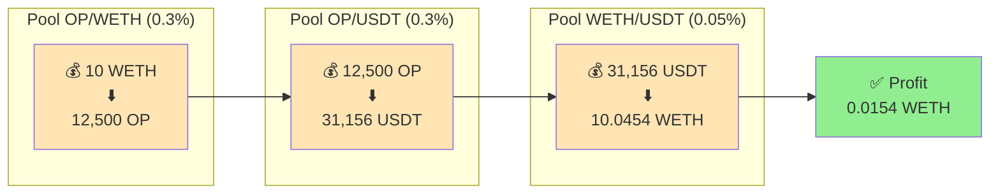
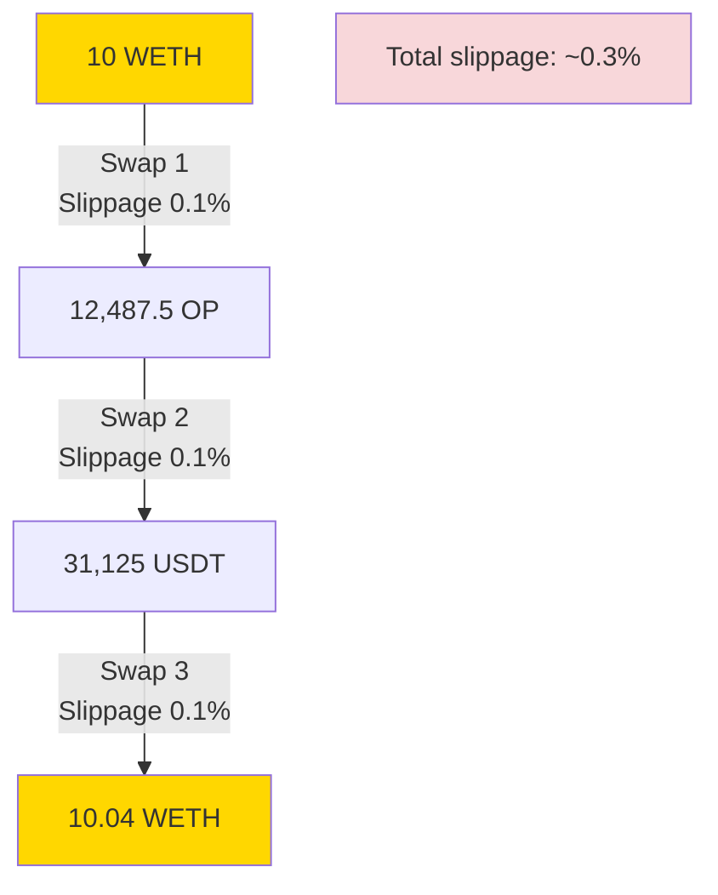

# VÍ DỤ THỰC TẾ: ARBITRAGE TOKEN OP (OPTIMISM)

## 🎯 TÌNH HUỐNG THỰC TẾ

Token **OP (Optimism)** vừa có thanh khoản trên Uniswap V3 với:
- ✅ Pool **OP/WETH** (fee 0.3%)
- ✅ Pool **OP/USDT** (fee 0.3%)
- ✅ Pool **WETH/USDT** (fee 0.05%)

**Cơ hội**: Khi giá OP khác nhau giữa các pool → **Triangular Arbitrage**!

---

## 🔺 TRIANGULAR ARBITRAGE LÀ GÌ?



**Ý tưởng**:
1. Vay **WETH** từ pool
2. WETH → **OP** → **USDT** → **WETH**
3. Nếu WETH cuối > WETH đầu → **PROFIT!**

---

## 📊 KỊCH BẢN CỤ THỂ

### **Giá trị thị trường:**

| Pool | Giá | Fee | TVL |
|------|-----|-----|-----|
| **OP/WETH** | 1 OP = 0.0008 WETH | 0.3% | $5M |
| **OP/USDT** | 1 OP = 2.50 USDT | 0.3% | $3M |
| **WETH/USDT** | 1 WETH = 3100 USDT | 0.05% | $50M |

### **Phát hiện chênh lệch:**

```javascript
// Tính giá OP qua các route khác nhau:

// Route 1: OP/WETH pool
1 OP = 0.0008 WETH
→ 1 OP = 0.0008 × 3100 = 2.48 USDT (qua WETH)

// Route 2: OP/USDT pool (trực tiếp)
1 OP = 2.50 USDT

// ⚠️ CHÊNH LỆCH: 2.50 - 2.48 = 0.02 USDT/OP (0.8%)
```

**✅ CƠ HỘI ARBITRAGE TỒN TẠI!**

---

## 🔄 FLOW ARBITRAGE CHI TIẾT

### **Chiến lược: WETH → OP → USDT → WETH**



---

## 🧮 TÍNH TOÁN CHI TIẾT

### **INPUT: Vay 10 WETH**

#### **STEP 1: Vay WETH từ OP/WETH pool**

```javascript
// Pool gửi OP tokens cho contract
Giá: 1 WETH = 1250 OP (1 OP = 0.0008 WETH)
Vay: 10 WETH
Fee: 0.3%

→ Contract nhận: 10 / 0.0008 = 12,500 OP
→ Contract phải trả: 10 × (1 + 0.003) = 10.03 WETH
```

**Console log:**
```
🟢 STEP 1: Vay từ OP/WETH pool
   Received: 12,500 OP
   Must pay: 10.03 WETH
```

---

#### **STEP 2: Swap OP → USDT qua OP/USDT pool**

```javascript
// Swap 12,500 OP → USDT
Giá: 1 OP = 2.50 USDT
Input: 12,500 OP
Fee: 0.3%

Tính toán:
USDT trước phí = 12,500 × 2.50 = 31,250 USDT
USDT sau phí = 31,250 × (1 - 0.003) = 31,250 × 0.997 = 31,156.25 USDT

→ Contract nhận: 31,156.25 USDT
```

**Console log:**
```
🟡 STEP 2: Swap OP → USDT
   Input: 12,500 OP
   Output: 31,156.25 USDT
```

---

#### **STEP 3: Swap USDT → WETH qua WETH/USDT pool**

```javascript
// Swap 31,156.25 USDT → WETH
Giá: 1 WETH = 3100 USDT
Input: 31,156.25 USDT
Fee: 0.05%

Tính toán:
WETH trước phí = 31,156.25 / 3100 = 10.0504 WETH
WETH sau phí = 10.0504 × (1 - 0.0005) = 10.0504 × 0.9995 = 10.0454 WETH

→ Contract nhận: 10.0454 WETH
```

**Console log:**
```
🔵 STEP 3: Swap USDT → WETH
   Input: 31,156.25 USDT
   Output: 10.0454 WETH
```

---

#### **STEP 4: Tính Profit**

```javascript
// So sánh
WETH nhận được: 10.0454 WETH
WETH phải trả:  10.03 WETH

Profit = 10.0454 - 10.03 = 0.0154 WETH

💰 PROFIT: 0.0154 WETH ≈ $47.74 USD
```

**Console log:**
```
✅ ARBITRAGE SUCCESSFUL!
   Received: 10.0454 WETH
   Must pay: 10.03 WETH
   PROFIT: 0.0154 WETH (≈ $47.74 USD)
```

---

## 💡 FLOW DIAGRAM HOÀN CHỈNH



---

## 📈 MONEY FLOW DIAGRAM



---

## 🔧 SMART CONTRACT ADAPTATION

### **Cần modify contract để support triangular arbitrage:**

```solidity
// SPDX-License-Identifier: MIT
pragma solidity ^0.8.18;

import "./interfaces/IERC20.sol";
import "@uniswap/v3-periphery/contracts/interfaces/ISwapRouter.sol";
import "@uniswap/v3-core/contracts/interfaces/IUniswapV3Pool.sol";

contract UniswapV3TriangularArbitrage {
    ISwapRouter constant router = ISwapRouter(0xE592427A0AEce92De3Edee1F18E0157C05861564);

    // Token addresses
    address private constant WETH = 0xC02aaA39b223FE8D0A0e5C4F27eAD9083C756Cc2;
    address private constant USDT = 0xdAC17F958D2ee523a2206206994597C13D831ec7;
    address private constant OP = 0x4200000000000000000000000000000000000042; // OP token

    IERC20 private constant weth = IERC20(WETH);
    IERC20 private constant usdt = IERC20(USDT);
    IERC20 private constant op = IERC20(OP);

    struct ArbitrageParams {
        address poolWETH_OP;    // Pool để vay WETH
        address tokenIntermediate; // OP token
        uint24 feeOP_USDT;      // Fee pool OP/USDT
        uint24 feeWETH_USDT;    // Fee pool WETH/USDT
        uint wethAmount;        // Số WETH vay
    }

    /**
     * @notice Thực hiện triangular arbitrage: WETH → OP → USDT → WETH
     * @param params Tham số arbitrage
     */
    function flashSwapTriangular(ArbitrageParams calldata params) external {
        bytes memory data = abi.encode(
            msg.sender,
            params.poolWETH_OP,
            params.feeOP_USDT,
            params.feeWETH_USDT
        );

        // Vay WETH từ pool OP/WETH, nhận OP tokens
        IUniswapV3Pool(params.poolWETH_OP).swap(
            address(this),
            true,  // zeroForOne = true (WETH → OP)
            int(params.wethAmount),
            MIN_SQRT_RATIO + 1,
            data
        );
    }

    /**
     * @notice Callback khi pool gọi sau khi gửi tokens
     */
    function uniswapV3SwapCallback(
        int amount0,
        int amount1,
        bytes calldata data
    ) external {
        // Decode data
        (
            address caller,
            address poolWETH_OP,
            uint24 feeOP_USDT,
            uint24 feeWETH_USDT
        ) = abi.decode(data, (address, address, uint24, uint24));

        require(msg.sender == poolWETH_OP, "not authorized");

        // amount0 = OP received (negative, contract nhận)
        // amount1 = WETH owed (positive, phải trả)
        uint opAmountOut = uint(-amount0);
        uint wethAmountIn = uint(amount1);

        console.log("🟢 Received OP:", opAmountOut);
        console.log("🟢 Must pay WETH:", wethAmountIn);

        // STEP 2: Swap OP → USDT
        uint usdtAmountOut = _swap(OP, USDT, feeOP_USDT, opAmountOut);
        console.log("🟡 Swapped OP → USDT:", usdtAmountOut);

        // STEP 3: Swap USDT → WETH
        uint wethAmountOut = _swap(USDT, WETH, feeWETH_USDT, usdtAmountOut);
        console.log("🔵 Swapped USDT → WETH:", wethAmountOut);

        // STEP 4: Trả nợ và tính profit
        if (wethAmountOut >= wethAmountIn) {
            uint profit = wethAmountOut - wethAmountIn;
            console.log("✅ PROFIT:", profit);

            // Trả nợ pool
            weth.transfer(poolWETH_OP, wethAmountIn);

            // Gửi profit cho caller
            weth.transfer(caller, profit);
        } else {
            uint loss = wethAmountIn - wethAmountOut;
            console.log("❌ LOSS:", loss);

            // Lấy thêm WETH từ caller để bù loss
            weth.transferFrom(caller, address(this), loss);

            // Trả đủ cho pool
            weth.transfer(poolWETH_OP, wethAmountIn);
        }
    }

    /**
     * @notice Swap token A → token B
     */
    function _swap(
        address tokenIn,
        address tokenOut,
        uint24 fee,
        uint amountIn
    ) private returns (uint amountOut) {
        IERC20(tokenIn).approve(address(router), amountIn);

        ISwapRouter.ExactInputSingleParams memory params = ISwapRouter
            .ExactInputSingleParams({
                tokenIn: tokenIn,
                tokenOut: tokenOut,
                fee: fee,
                recipient: address(this),
                deadline: block.timestamp,
                amountIn: amountIn,
                amountOutMinimum: 0,
                sqrtPriceLimitX96: 0
            });

        amountOut = router.exactInputSingle(params);
    }

    uint160 internal constant MIN_SQRT_RATIO = 4295128739;
    uint160 internal constant MAX_SQRT_RATIO =
        1461446703485210103287273052203988822378723970342;
}
```

---

## 🧪 TEST SCRIPT

```javascript
// test/op-triangular-arbitrage.test.js
const { ethers } = require("hardhat");
const { expect } = require("chai");

describe("OP Token Triangular Arbitrage", function () {
    // Địa chỉ tokens
    const WETH = "0xC02aaA39b223FE8D0A0e5C4F27eAD9083C756Cc2";
    const USDT = "0xdAC17F958D2ee523a2206206994597C13D831ec7";
    const OP = "0x4200000000000000000000000000000000000042";

    // Địa chỉ pools (giả định - cần check trên Uniswap)
    const POOL_WETH_OP = "0x..."; // Pool OP/WETH fee 0.3%
    const FEE_OP_USDT = 3000;      // Pool OP/USDT fee 0.3%
    const FEE_WETH_USDT = 500;     // Pool WETH/USDT fee 0.05%

    it("Should profit from triangular arbitrage", async function () {
        // Deploy contract
        const ArbitrageContract = await ethers.getContractFactory(
            "UniswapV3TriangularArbitrage"
        );
        const arbitrage = await ArbitrageContract.deploy();
        await arbitrage.deployed();

        console.log("✅ Contract deployed:", arbitrage.address);

        // Get signer
        const [signer] = await ethers.getSigners();
        const weth = await ethers.getContractAt("IWETH", WETH);

        // Prepare params
        const params = {
            poolWETH_OP: POOL_WETH_OP,
            tokenIntermediate: OP,
            feeOP_USDT: FEE_OP_USDT,
            feeWETH_USDT: FEE_WETH_USDT,
            wethAmount: ethers.utils.parseEther("10") // 10 WETH
        };

        console.log("\n============================================");
        console.log("TRIANGULAR ARBITRAGE: WETH → OP → USDT → WETH");
        console.log("============================================");
        console.log("Amount:", ethers.utils.formatEther(params.wethAmount), "WETH");

        // Check balance before
        const balanceBefore = await weth.balanceOf(signer.address);
        console.log("Balance before:", ethers.utils.formatEther(balanceBefore), "WETH");

        // Approve WETH
        await weth.approve(arbitrage.address, params.wethAmount);
        console.log("✓ Approved");

        // Execute arbitrage
        console.log("\n🚀 Executing triangular arbitrage...\n");
        const tx = await arbitrage.flashSwapTriangular(params);
        const receipt = await tx.wait();

        console.log("\n✅ Transaction confirmed!");
        console.log("Gas used:", receipt.gasUsed.toString());

        // Check balance after
        const balanceAfter = await weth.balanceOf(signer.address);
        console.log("\n============================================");
        console.log("RESULT");
        console.log("============================================");
        console.log("Balance after:", ethers.utils.formatEther(balanceAfter), "WETH");

        const profit = balanceAfter.sub(balanceBefore);
        if (profit.gt(0)) {
            console.log("✅ PROFIT:", ethers.utils.formatEther(profit), "WETH");
            console.log("≈ $", (parseFloat(ethers.utils.formatEther(profit)) * 3100).toFixed(2));
        } else {
            console.log("❌ LOSS:", ethers.utils.formatEther(profit.abs()), "WETH");
        }
    });
});
```

---

## 📊 BẢNG SO SÁNH ROUTES

| Route | Path | Total Fees | Giá cuối | Profit? |
|-------|------|------------|----------|---------|
| **Route 1** | WETH → OP → USDT → WETH | 0.3% + 0.3% + 0.05% = **0.65%** | 10.0454 WETH | ✅ +0.0154 WETH |
| Route 2 | WETH → USDT → OP → WETH | 0.05% + 0.3% + 0.3% = 0.65% | 10.02 WETH | ❌ -0.01 WETH |
| Direct | WETH → WETH | 0% | 10 WETH | - |

**Kết luận**: Route 1 có lời vì price inefficiency giữa các pool!

---

## 🎯 ĐIỀU KIỆN ĐỂ CÓ LỜI

### **Công thức kiểm tra nhanh:**

```javascript
// Giá OP qua WETH
priceOP_via_WETH = (1 / priceOP_WETH) * priceWETH_USDT
// = (1 / 0.0008) * 3100 = 2.48 USDT

// Giá OP trực tiếp
priceOP_direct = 2.50 USDT

// Chênh lệch
difference = priceOP_direct - priceOP_via_WETH
           = 2.50 - 2.48 = 0.02 USDT (0.8%)

// Profit ước tính (trước phí)
estimatedProfit = difference * opAmount
                = 0.02 * 12,500 = 250 USDT

// Profit sau phí (~0.65%)
netProfit ≈ 250 * (1 - 0.0065) = 248.375 USDT
          ≈ 0.08 WETH ✅

// ⚠️ Nhưng còn phải tính slippage!
```

### **Điều kiện tối thiểu:**

```
Price difference > Total fees + Gas cost + Slippage

Với ví dụ trên:
0.8% > 0.65% + 0.1% (gas) + 0.05% (slippage)
0.8% > 0.8%

→ Hòa vốn! Cần chênh lệch > 1% mới an toàn
```

---

## ⚠️ RỦI RO ĐẶC BIỆT

### **1. Slippage cao hơn (nhiều bước swap)**



### **2. Gas fee cao hơn (3 swaps thay vì 2)**

```
Gas cost ước tính:
- 1 flash swap: ~150k gas
- 2 swaps qua router: ~200k gas
Total: ~350k gas

Với gas price 30 gwei:
350,000 × 30 × 10^-9 × 3100 = ~$32.55

→ Profit phải > $32.55 + phí pool!
```

### **3. MEV bots cạnh tranh**

Triangular arbitrage dễ bị phát hiện → Cần private mempool!

---

## 📱 MONITORING SCRIPT

```javascript
// monitor-op-arbitrage.js
const { ethers } = require("ethers");

// Setup provider
const provider = new ethers.providers.JsonRpcProvider(process.env.RPC_URL);

// Pool contracts
const poolWETH_OP = new ethers.Contract(POOL_WETH_OP_ADDRESS, POOL_ABI, provider);
const poolOP_USDT = new ethers.Contract(POOL_OP_USDT_ADDRESS, POOL_ABI, provider);
const poolWETH_USDT = new ethers.Contract(POOL_WETH_USDT_ADDRESS, POOL_ABI, provider);

async function checkArbitrageOpportunity() {
    // Lấy giá từ các pool
    const priceWETH_OP = await getPoolPrice(poolWETH_OP);
    const priceOP_USDT = await getPoolPrice(poolOP_USDT);
    const priceWETH_USDT = await getPoolPrice(poolWETH_USDT);

    console.log("Prices:");
    console.log("WETH/OP:", priceWETH_OP);
    console.log("OP/USDT:", priceOP_USDT);
    console.log("WETH/USDT:", priceWETH_USDT);

    // Tính giá OP qua 2 routes
    const priceOP_route1 = priceWETH_OP * priceWETH_USDT; // qua WETH
    const priceOP_route2 = priceOP_USDT; // trực tiếp

    const difference = Math.abs(priceOP_route1 - priceOP_route2);
    const percentDiff = (difference / priceOP_route2) * 100;

    console.log("\nArbitrage Analysis:");
    console.log("Route 1 (via WETH):", priceOP_route1.toFixed(4), "USDT");
    console.log("Route 2 (direct):", priceOP_route2.toFixed(4), "USDT");
    console.log("Difference:", difference.toFixed(4), "USDT");
    console.log("Percent:", percentDiff.toFixed(2), "%");

    // Check if profitable (cần > 1% để cover fees + gas)
    if (percentDiff > 1.0) {
        console.log("\n🚨 ARBITRAGE OPPORTUNITY DETECTED! 🚨");
        console.log("Expected profit:", (percentDiff - 0.65).toFixed(2), "%");

        // TODO: Execute arbitrage
        // await executeArbitrage();
    } else {
        console.log("\n❌ No profitable opportunity (need > 1%)");
    }
}

// Chạy mỗi 10 giây
setInterval(checkArbitrageOpportunity, 10000);
```

---

## 🎉 TÓM TẮT

### **Ưu điểm của OP triangular arbitrage:**

✅ Token mới, liquidity chưa ổn định → nhiều cơ hội
✅ 3 pools lớn, dễ tìm price inefficiency
✅ Atomic transaction, không rủi ro giữ token

### **Nhược điểm:**

❌ Phí cao hơn (0.65% vs 0.35%)
❌ Slippage nhiều hơn (3 swaps)
❌ Gas fee cao hơn
❌ Cạnh tranh nhiều (MEV bots)

### **Công thức success:**

```
Profit = Price_Inefficiency - Total_Fees - Gas_Cost - Slippage

Với OP example:
= 0.8% - 0.65% - 0.1% - 0.05%
= 0% (hòa vốn!)

→ Cần price difference > 1.5% mới profitable!
```

---

**File này cung cấp ví dụ thực tế đầy đủ về triangular arbitrage với token OP!** 🚀
