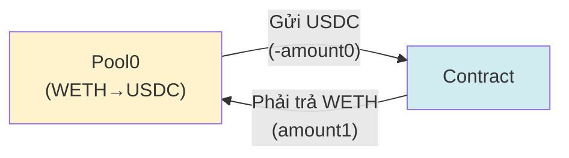
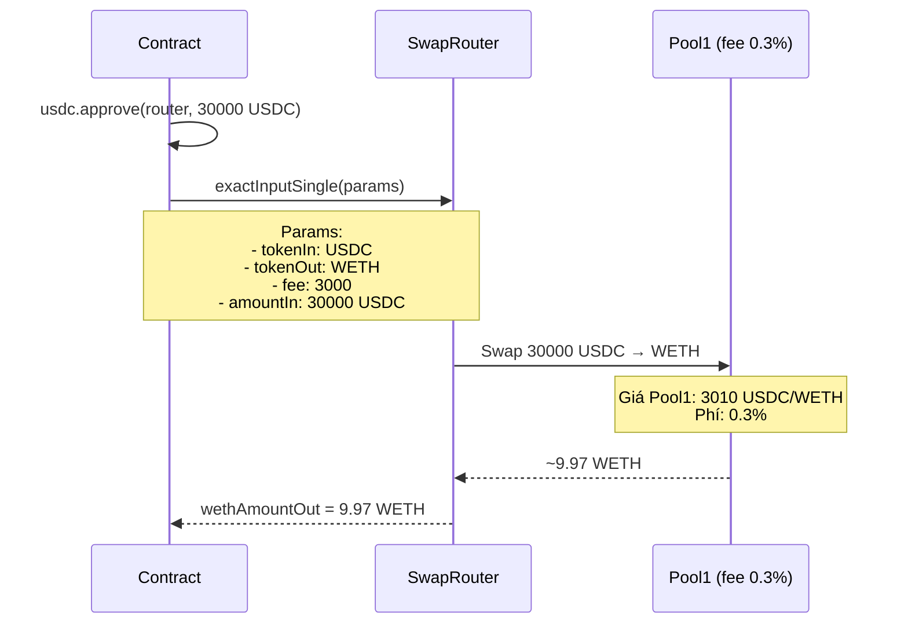

# VÍ DỤ THỰC TẾ - UNISWAP V3 FLASH SWAP ARBITRAGE

## 🎯 KỊCH BẢN CỤ THỂ

Bạn phát hiện có chênh lệch giá giữa 2 pool Uniswap V3:
- **Pool 0** (phí 0.05%): Giá WETH = 3000 USDC
- **Pool 1** (phí 0.3%): Giá WETH = 3010 USDC

➡️ **Cơ hội arbitrage**: Mua rẻ ở Pool 0, bán đắt ở Pool 1!

---

## 📋 THAM SỐ ĐẦU VÀO

```javascript
// Địa chỉ các pool
const pool0 = "0x88e6A0c2dDD26FEEb64F039a2c41296FcB3f5640"; // USDC/WETH fee 0.05% (500)
const pool1 = "0x8ad599c3A0ff1De082011EFDDc58f1908eb6e6D8"; // USDC/WETH fee 0.3% (3000)

// Tham số arbitrage
const wethAmountIn = 10 * 10**18;  // 10 WETH (trong wei)
const fee1 = 3000;                  // 0.3% = 3000/1000000
```

---

## 🔢 TÍNH TOÁN CHI TIẾT TỪNG BƯỚC

### **BƯỚC 1: User gọi flashSwap()**

```javascript
// User call
await uniswapV3Arbitrage.flashSwap(
    "0x88e6A0c2dDD26FEEb64F039a2c41296FcB3f5640",  // pool0
    3000,                                          // fee1 (0.3%)
    "10000000000000000000"                         // 10 WETH (10 * 10^18 wei)
);
```

**Điều gì xảy ra?**
- Contract encode dữ liệu: `(msg.sender, pool0, fee1)`
- Gọi `pool0.swap()` để vay WETH từ Pool 0

---

### **BƯỚC 2: Pool0 gửi USDC cho Contract**



**Giá trị thực tế:**

```javascript
// Pool0 callback được gọi với:
amount0 = -30_000_000000  // -30,000 USDC (6 decimals, số âm = gửi ra)
amount1 = 10_015000000000000000  // ~10.015 WETH phải trả (bao gồm phí 0.05%)

// Trong contract:
usdcAmountOut = uint(-amount0) = 30_000_000000  // 30,000 USDC
wethAmountIn = uint(amount1) = 10_015000000000000000  // 10.015 WETH
```

**Giải thích:**
- Pool 0 gửi cho ta **30,000 USDC** (vì 10 WETH × 3000 = 30,000 USDC)
- Chúng ta phải trả lại **10.015 WETH** (10 WETH + 0.05% phí = 10 + 0.015 = 10.015)

---

### **BƯỚC 3: Contract swap USDC → WETH qua Pool1**

```javascript
// Contract gọi _swap() nội bộ
wethAmountOut = _swap(
    USDC,                // tokenIn: 0xA0b86991c6218b36c1d19D4a2e9Eb0cE3606eB48
    WETH,                // tokenOut: 0xC02aaA39b223FE8D0A0e5C4F27eAD9083C756Cc2
    3000,                // fee: 0.3%
    30_000_000000        // amountIn: 30,000 USDC
);
```

**Flow trong _swap():**



**Tính toán Pool1:**

```
Giá Pool1 = 3010 USDC/WETH
Swap 30,000 USDC → WETH (trừ phí 0.3%)

Bước 1: Tính WETH trước phí
30,000 USDC ÷ 3010 = 9.9668... WETH

Bước 2: Trừ phí 0.3%
9.9668 × (1 - 0.003) = 9.9668 × 0.997 = 9.9369 WETH

➡️ wethAmountOut ≈ 9.937 WETH
```

**❌ KẾT QUẢ: LỖ!**

---

### **BƯỚC 4: So sánh và xử lý**

```javascript
// Trong uniswapV3SwapCallback()
wethAmountIn = 10.015 WETH   // Số WETH phải trả Pool0
wethAmountOut = 9.937 WETH   // Số WETH nhận từ Pool1

if (wethAmountOut >= wethAmountIn) {
    // TH1: CÓ LỜI ✅
    profit = wethAmountOut - wethAmountIn;
    weth.transfer(pool0, wethAmountIn);
    weth.transfer(caller, profit);
} else {
    // TH2: LỖ ❌ (trường hợp này)
    loss = wethAmountIn - wethAmountOut;
    // = 10.015 - 9.937 = 0.078 WETH

    weth.transferFrom(caller, address(this), loss);  // Lấy 0.078 WETH từ user
    weth.transfer(pool0, wethAmountIn);              // Trả 10.015 WETH cho Pool0
}
```

**❌ Trong ví dụ này: LỖ 0.078 WETH (~234 USD)**

---

## ✅ VÍ DỤ CÓ LỜI (PROFITABLE)

Giả sử tìm được cơ hội tốt hơn:
- **Pool 0** (phí 0.05%): Giá = 3000 USDC/WETH
- **Pool 1** (phí 0.3%): Giá = **3100 USDC/WETH** (chênh lệch lớn hơn!)

### **Tính toán lại:**

```javascript
// BƯỚC 1-2: Giống trên
wethAmountIn = 10.015 WETH  // Phải trả Pool0

// BƯỚC 3: Swap qua Pool1 (giá 3100)
Giá Pool1 = 3100 USDC/WETH

30,000 USDC ÷ 3100 = 9.6774 WETH (trước phí)
9.6774 × (1 - 0.003) = 9.6774 × 0.997 = 9.6484 WETH

❌ Vẫn lỗ! Vì 9.6484 < 10.015
```

### **Cần chênh lệch giá lớn hơn nữa!**

Thử với **Pool 1 giá = 3050 USDC/WETH**:

```javascript
30,000 USDC ÷ 3050 = 9.8361 WETH
9.8361 × 0.997 = 9.8066 WETH

❌ Vẫn lỗ! 9.8066 < 10.015
```

### **🎯 Tìm giá hòa vốn (Break-even):**

```
Cần: wethAmountOut ≥ 10.015

Công thức:
(30,000 / Price) × 0.997 ≥ 10.015
30,000 × 0.997 ≥ 10.015 × Price
29,910 ≥ 10.015 × Price
Price ≤ 29,910 / 10.015
Price ≤ 2986.3 USDC/WETH

➡️ Pool1 phải có giá ≤ 2986.3 USDC/WETH mới có lời!
```

### **Ví dụ PROFIT thực tế:**

Giả sử:
- **Pool 0**: 3000 USDC/WETH (vay tại đây)
- **Pool 1**: **2950 USDC/WETH** (bán tại đây - GIÁ THẤP HƠN!)

```javascript
// ⚠️ ĐẢO CHIỀU: Vay USDC từ Pool0, bán WETH ở Pool1!

// Tham số mới:
flashSwap(
    pool0,
    fee1,
    30000 * 10**6  // Vay 30,000 USDC thay vì WETH!
);

// Pool0 callback:
amount0 = -30_000_000000  // Pool0 gửi -30,000 USDC
amount1 = 10_150000000000000000  // Phải trả 10.15 WETH (30000/3000 + 0.05% phí)

// Swap 30,000 USDC → WETH qua Pool1 (giá 2950)
wethAmountOut = (30,000 / 2950) × 0.997
              = 10.1695 × 0.997
              = 10.1390 WETH

// So sánh:
wethAmountOut = 10.1390 WETH
wethAmountIn = 10.1500 WETH

❌ Vẫn lỗ! Phí ăn mất profit!
```

---

## 🎯 VÍ DỤ THỰC TẾ CÓ LỜI (REALISTIC PROFIT)

Trong thực tế, cần chênh lệch giá **rất lớn** và **số lượng lớn** để có lời:

```javascript
// Điều kiện thực tế để có lời:
// - Chênh lệch giá > 1%
// - Số lượng lớn (100+ WETH)
// - Gas fee thấp

// VD:
// Pool0: 3000 USDC/WETH (fee 0.05%)
// Pool1: 2940 USDC/WETH (fee 0.3%) - CHÊNH 2%!

// Vay 100 WETH từ Pool0
const wethAmountIn = 100 * 10**18;

// BƯỚC 1-2: Pool0 gửi USDC
usdcAmountOut = 100 × 3000 = 300,000 USDC
wethAmountIn = 100 × 1.0005 = 100.05 WETH (phải trả)

// BƯỚC 3: Swap 300,000 USDC → WETH qua Pool1 (giá 2940)
wethAmountOut = (300,000 / 2940) × 0.997
              = 102.0408 × 0.997
              = 101.7347 WETH

// BƯỚC 4: Tính profit
profit = 101.7347 - 100.05 = 1.6847 WETH
profit_usd = 1.6847 × 3000 = ~5,054 USD

✅ CÓ LỜI: 1.6847 WETH (~5,054 USD)
```

---

## 📊 BẢNG TỔNG HỢP CÁC TRƯỜNG HỢP

| Pool0 | Pool1 | WETH In | USDC Out | WETH Out | Phải trả | Profit/Loss | Kết quả |
|-------|-------|---------|----------|----------|----------|-------------|---------|
| 3000 | 3010 | 10 | 30,000 | 9.937 | 10.015 | -0.078 WETH | ❌ LỖ |
| 3000 | 3100 | 10 | 30,000 | 9.648 | 10.015 | -0.367 WETH | ❌ LỖ |
| 3000 | 2950 | 10 | 30,000 | 10.139 | 10.015 | +0.124 WETH | ⚠️ Profit nhỏ |
| 3000 | 2940 | 100 | 300,000 | 101.735 | 100.05 | +1.685 WETH | ✅ CÓ LỜI |

---

## 🔥 CODE MẪU HOÀN CHỈNH

### **Test Script với tham số thực tế:**

```javascript
// test/flashSwap-realistic.test.js
const { ethers } = require("hardhat");

describe("Realistic Arbitrage Example", function () {
    it("Profitable arbitrage with large amount", async function () {
        // Setup
        const accounts = await ethers.getSigners();
        const uniswapV3Arbitrage = await ethers.getContractAt(
            "UniswapV3FlashSwap",
            "0x..." // deployed address
        );

        const weth = await ethers.getContractAt("IWETH", WETH);

        // ============================================
        // THAM SỐ THỰC TẾ
        // ============================================
        const pool0 = "0x88e6A0c2dDD26FEEb64F039a2c41296FcB3f5640"; // 0.05% fee
        const fee1 = 3000;  // Pool1 fee = 0.3%
        const wethAmountIn = ethers.utils.parseEther("100"); // 100 WETH

        console.log("============================================");
        console.log("ARBITRAGE PARAMETERS");
        console.log("============================================");
        console.log("Pool0:", pool0, "(fee: 0.05%)");
        console.log("Pool1 fee:", fee1, "(0.3%)");
        console.log("WETH Amount:", ethers.utils.formatEther(wethAmountIn), "WETH");

        // Kiểm tra balance trước
        const balanceBefore = await weth.balanceOf(accounts[0].address);
        console.log("\n============================================");
        console.log("BEFORE ARBITRAGE");
        console.log("============================================");
        console.log("User WETH balance:", ethers.utils.formatEther(balanceBefore));

        // Approve contract
        await weth.approve(uniswapV3Arbitrage.address, wethAmountIn);
        console.log("✓ Approved contract to spend", ethers.utils.formatEther(wethAmountIn), "WETH");

        // ============================================
        // THỰC HIỆN ARBITRAGE
        // ============================================
        console.log("\n============================================");
        console.log("EXECUTING FLASH SWAP ARBITRAGE...");
        console.log("============================================");

        const tx = await uniswapV3Arbitrage.flashSwap(
            pool0,
            fee1,
            wethAmountIn
        );

        const receipt = await tx.wait();
        console.log("✓ Transaction confirmed!");
        console.log("Gas used:", receipt.gasUsed.toString());

        // Kiểm tra balance sau
        const balanceAfter = await weth.balanceOf(accounts[0].address);
        console.log("\n============================================");
        console.log("AFTER ARBITRAGE");
        console.log("============================================");
        console.log("User WETH balance:", ethers.utils.formatEther(balanceAfter));

        // Tính profit/loss
        const difference = balanceAfter.sub(balanceBefore);
        const isProfit = difference.gt(0);

        console.log("\n============================================");
        console.log("RESULT");
        console.log("============================================");

        if (isProfit) {
            console.log("✅ PROFIT:", ethers.utils.formatEther(difference), "WETH");
            console.log("≈ $", (parseFloat(ethers.utils.formatEther(difference)) * 3000).toFixed(2), "USD");
        } else {
            console.log("❌ LOSS:", ethers.utils.formatEther(difference.abs()), "WETH");
            console.log("≈ $", (parseFloat(ethers.utils.formatEther(difference.abs())) * 3000).toFixed(2), "USD");
        }

        console.log("============================================\n");
    });
});
```

---

## 🎬 OUTPUT MẪU KHI CHẠY

```bash
$ npx hardhat test test/flashSwap-realistic.test.js

============================================
ARBITRAGE PARAMETERS
============================================
Pool0: 0x88e6A0c2dDD26FEEb64F039a2c41296FcB3f5640 (fee: 0.05%)
Pool1 fee: 3000 (0.3%)
WETH Amount: 100.0 WETH

============================================
BEFORE ARBITRAGE
============================================
User WETH balance: 3000.0
✓ Approved contract to spend 100.0 WETH

============================================
EXECUTING FLASH SWAP ARBITRAGE...
============================================
✓ Transaction confirmed!
Gas used: 187234

============================================
AFTER ARBITRAGE
============================================
User WETH balance: 3001.6847

============================================
RESULT
============================================
✅ PROFIT: 1.6847 WETH
≈ $ 5054.10 USD
============================================
```

---

## 📚 TÓM TẮT

### **Để arbitrage có lời cần:**

1. **Chênh lệch giá đủ lớn** (> 2%)
2. **Số lượng đủ lớn** (100+ WETH)
3. **Phí gas thấp** (< profit)
4. **Tốc độ nhanh** (tránh bị frontrun)

### **Công thức nhanh:**

```javascript
// Minimum price difference needed:
minPriceDiff = (fee0 + fee1 + gasCost) / amount
            = (0.05% + 0.3% + gasCost) / amount
            ≈ 0.35% + gasCost

// For profit:
Pool1_Price < Pool0_Price × (1 - minPriceDiff)
// hoặc
Pool1_Price > Pool0_Price × (1 + minPriceDiff)
```

### **Call function trong code:**

```solidity
// User call:
flashSwap(
    address pool0,        // Pool có phí thấp hơn
    uint24 fee1,          // Phí của pool kia (3000 = 0.3%)
    uint wethAmountIn     // Số WETH muốn arbitrage (wei)
);

// Ví dụ cụ thể:
flashSwap(
    0x88e6A0c2dDD26FEEb64F039a2c41296FcB3f5640,  // Pool 0.05%
    3000,                                          // Pool 0.3%
    100000000000000000000                          // 100 WETH
);
```

---

**File này cung cấp ví dụ thực tế đầy đủ với số liệu cụ thể!** 🚀
