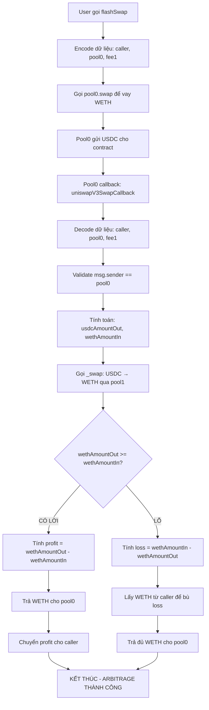
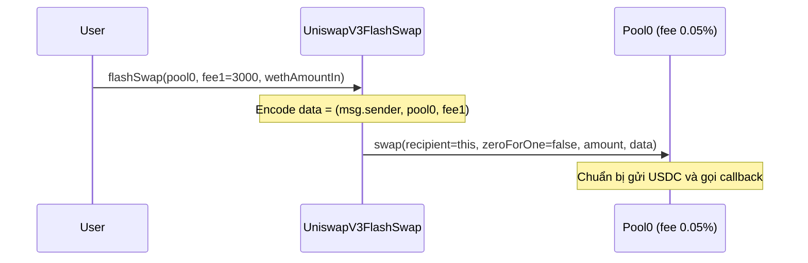
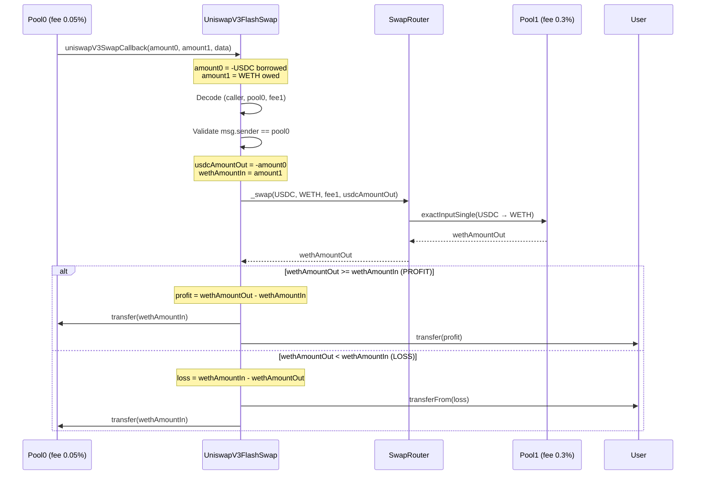
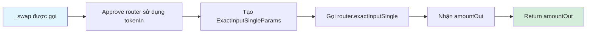
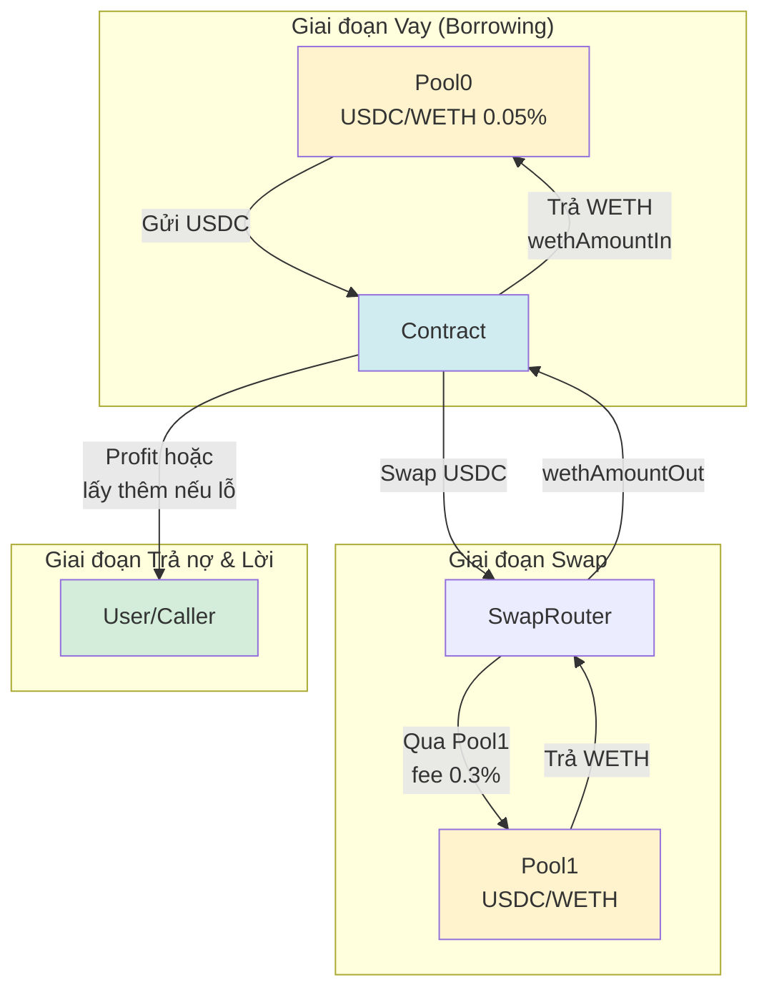
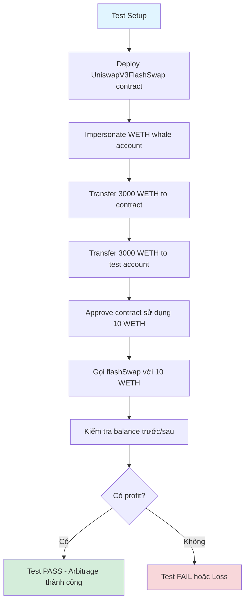
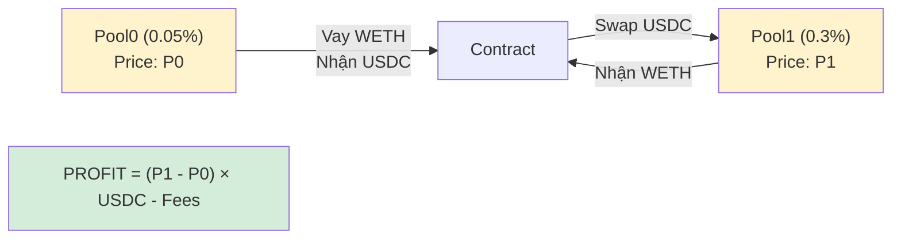
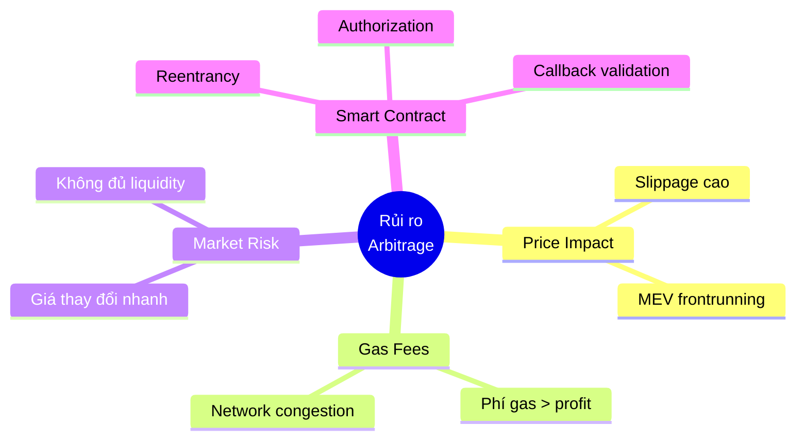
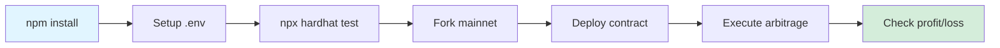

# PHÂN TÍCH FLOW DỰ ÁN UNISWAP V3 FLASH SWAP ARBITRAGE

## 📋 TỔNG QUAN DỰ ÁN

**Mục đích**: Kiếm lời arbitrage từ chênh lệch giá giữa 2 pool Uniswap V3 (USDC/WETH) với mức phí khác nhau.

**Chiến lược**:
- Pool 0: USDC/WETH với phí 0.05% (500)
- Pool 1: USDC/WETH với phí 0.3% (3000)
- Sử dụng flash swap để vay USDC, swap sang WETH, trả nợ và kiếm lời chênh lệch

---

## 🔄 LUỒNG HOẠT ĐỘNG CHÍNH (MAIN FLOW)



---

## 🔍 CHI TIẾT FLOW TỪNG BƯỚC

### **BƯỚC 1: Khởi tạo Flash Swap**



**Code tương ứng** (`UniswapV3Arbitrage.sol:24-38`):
```solidity
function flashSwap(address pool0, uint24 fee1, uint wethAmountIn) external {
    bytes memory data = abi.encode(msg.sender, pool0, fee1);

    IUniswapV3Pool(pool0).swap(
        address(this),      // recipient
        false,              // zeroForOne (WETH -> USDC)
        int(wethAmountIn),  // amountSpecified
        MAX_SQRT_RATIO - 1, // sqrtPriceLimitX96
        data                // callback data
    );
}
```

---

### **BƯỚC 2: Callback và Xử lý Arbitrage**



**Code tương ứng** (`UniswapV3Arbitrage.sol:63-88`):
```solidity
function uniswapV3SwapCallback(int amount0, int amount1, bytes calldata data) external {
    (address caller, address pool0, uint24 fee1) = abi.decode(data, (address, address, uint24));
    require(msg.sender == address(pool0), "not authorized");

    uint usdcAmountOut = uint(-amount0);  // USDC nhận được
    uint wethAmountIn = uint(amount1);     // WETH phải trả
    uint wethAmountOut = _swap(USDC, WETH, fee1, usdcAmountOut);

    if (wethAmountOut >= wethAmountIn) {
        // CÓ LỜI
        uint profit = wethAmountOut - wethAmountIn;
        weth.transfer(address(pool0), wethAmountIn);
        weth.transfer(caller, profit);
    } else {
        // LỖ
        uint loss = wethAmountIn - wethAmountOut;
        weth.transferFrom(caller, address(this), loss);
        weth.transfer(address(pool0), wethAmountIn);
    }
}
```

---

### **BƯỚC 3: Hàm Swap Nội bộ**



**Code tương ứng** (`UniswapV3Arbitrage.sol:40-61`):
```solidity
function _swap(address tokenIn, address tokenOut, uint24 fee, uint amountIn)
    private returns (uint amountOut) {

    IERC20(tokenIn).approve(address(router), amountIn);

    ISwapRouter.ExactInputSingleParams memory params = ISwapRouter.ExactInputSingleParams({
        tokenIn: tokenIn,
        tokenOut: tokenOut,
        fee: fee,
        recipient: address(this),
        deadline: block.timestamp,
        amountIn: amountIn,
        amountOutMinimum: 0,
        sqrtPriceLimitX96: 0
    });

    amountOut = router.exactInputSingle(params);
}
```

---

## 💰 LUỒNG TIỀN (MONEY FLOW)



**Ví dụ số liệu**:
- Input: 10 WETH
- Pool0 gửi cho contract: ~30,000 USDC (giá WETH ≈ $3000)
- Contract swap 30,000 USDC → WETH qua Pool1 (fee cao hơn)
- Nếu nhận được > 10 WETH → Profit
- Nếu nhận được < 10 WETH → Loss (user phải bù)

---

## 🧪 LUỒNG TEST



**Code test** (`test/flashSwap.test.js:53-77`):
```javascript
it("does the arbitrage", async function () {
    const wethAmountIn = 10n * 10n ** 18n;  // 10 WETH

    const wethBalanceBefore = await weth.balanceOf(accounts[0].address);
    console.log("WETH balance of CALLER before", ethers.utils.formatEther(wethBalanceBefore));

    await weth.approve(uniswapV3Arbitrage.address, wethAmountIn);
    await uniswapV3Arbitrage.flashSwap(pool0, fee1, wethAmountIn);

    const wethBalanceAfter = await weth.balanceOf(accounts[0].address);
    console.log("WETH balance of CALLER after", ethers.utils.formatEther(wethBalanceAfter));

    // So sánh để xem có profit không
});
```

---

## 🏗️ KIẾN TRÚC DỰ ÁN

```mermaid
graph TB
    subgraph "Smart Contracts"
        UC[UniswapV3FlashSwap.sol<br/>Main contract]
        I1[IERC20.sol<br/>Token interface]
        I2[IWeth.sol<br/>WETH interface]
    end

    subgraph "External Dependencies"
        UV3C[@uniswap/v3-core<br/>Pool contracts]
        UV3P[@uniswap/v3-periphery<br/>SwapRouter]
    end

    subgraph "Testing & Config"
        HH[Hardhat<br/>Development framework]
        ENV[.env<br/>Config file]
        TEST[flashSwap.test.js<br/>Test suite]
    end

    UC --> I1
    UC --> I2
    UC --> UV3P
    UC --> UV3C
    TEST --> UC
    HH --> TEST
    ENV --> HH

    style UC fill:#4CAF50,color:#fff
    style UV3C fill:#FF9800
    style UV3P fill:#FF9800
    style HH fill:#2196F3,color:#fff
```

---

## 📊 CÔNG THỨC TOÁN HỌC ARBITRAGE

### **Điều kiện có lời**:

```
Profit = wethAmountOut - wethAmountIn > 0
```

Trong đó:
- `wethAmountIn`: Số WETH phải trả cho Pool0
- `wethAmountOut`: Số WETH nhận từ Pool1 sau khi swap USDC

### **Chi tiết tính toán**:



**Công thức đầy đủ từ README**:

```
Arbitrage Profit (A) = dy1 - dy0
                     = (P1 - P0) × dx - fee_impact

Với:
- dx: Số lượng token X được swap
- dy0: Token Y bán trên CEX
- dy1: Token Y mua lại từ AMM
- P0, P1: Giá trên 2 pool
```

---

## 🔐 CÁC ĐỊA CHỈ QUAN TRỌNG

| Tên | Địa chỉ | Mô tả |
|-----|---------|-------|
| **USDC** | `0xA0b86991c6218b36c1d19D4a2e9Eb0cE3606eB48` | USD Coin token |
| **WETH** | `0xC02aaA39b223FE8D0A0e5C4F27eAD9083C756Cc2` | Wrapped Ether |
| **SwapRouter** | `0xE592427A0AEce92De3Edee1F18E0157C05861564` | Uniswap V3 Router |
| **Pool0 (0.05%)** | `0x88e6A0c2dDD26FEEb64F039a2c41296FcB3f5640` | USDC/WETH pool phí thấp |
| **Pool1 (0.3%)** | `0x8ad599c3A0ff1De082011EFDDc58f1908eb6e6D8` | USDC/WETH pool phí cao |

---

## ⚠️ RỦI RO VÀ LƯU Ý



### **Các biện pháp bảo vệ trong code**:

1. **Authorization check**:
   ```solidity
   require(msg.sender == address(pool0), "not authorized");
   ```

2. **Xử lý cả trường hợp lời và lỗ**:
   ```solidity
   if (wethAmountOut >= wethAmountIn) { ... } else { ... }
   ```

3. **Sử dụng sqrtPriceLimitX96** để giới hạn price impact

---

## 🚀 CÁCH CHẠY DỰ ÁN

### **Setup**:
```bash
npm install
```

### **Tạo file .env**:
```env
ALCHEMY_API_KEY=your_alchemy_api_key
WETH_WHALE=0x... # Địa chỉ whale có nhiều WETH
```

### **Chạy test**:
```bash
npx hardhat test test/flashSwap.test.js
```

### **Test flow**:


---

## 📈 KẾT LUẬN

### **Ưu điểm**:
- ✅ Không cần vốn ban đầu (flash swap)
- ✅ Atomic transaction (all or nothing)
- ✅ Tự động kiếm lời từ chênh lệch giá
- ✅ Code đơn giản, dễ hiểu

### **Nhược điểm**:
- ❌ Cạnh tranh cao (MEV bots)
- ❌ Profit margin thường rất nhỏ
- ❌ Gas fees có thể cao hơn profit
- ❌ Cần monitor liên tục để tìm cơ hội

### **Workflow tổng thể**:
```
User → flashSwap() → Pool0 vay USDC → Callback → Swap USDC→WETH qua Pool1
→ So sánh profit/loss → Trả nợ Pool0 → Chuyển profit cho User
```

---

**Tài liệu này tổng hợp đầy đủ flow và phân tích kỹ thuật của dự án Uniswap V3 Flash Swap Arbitrage.**
