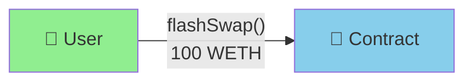
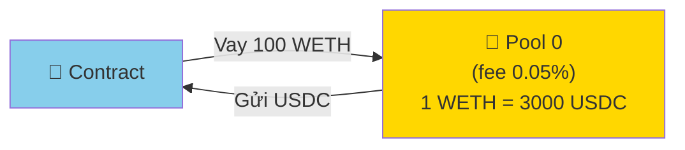
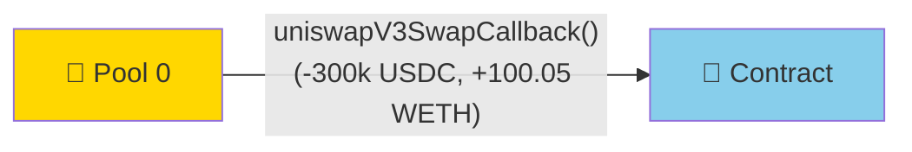
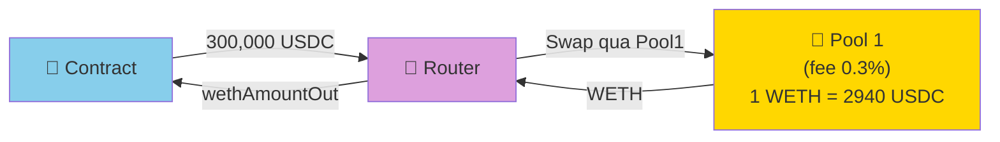
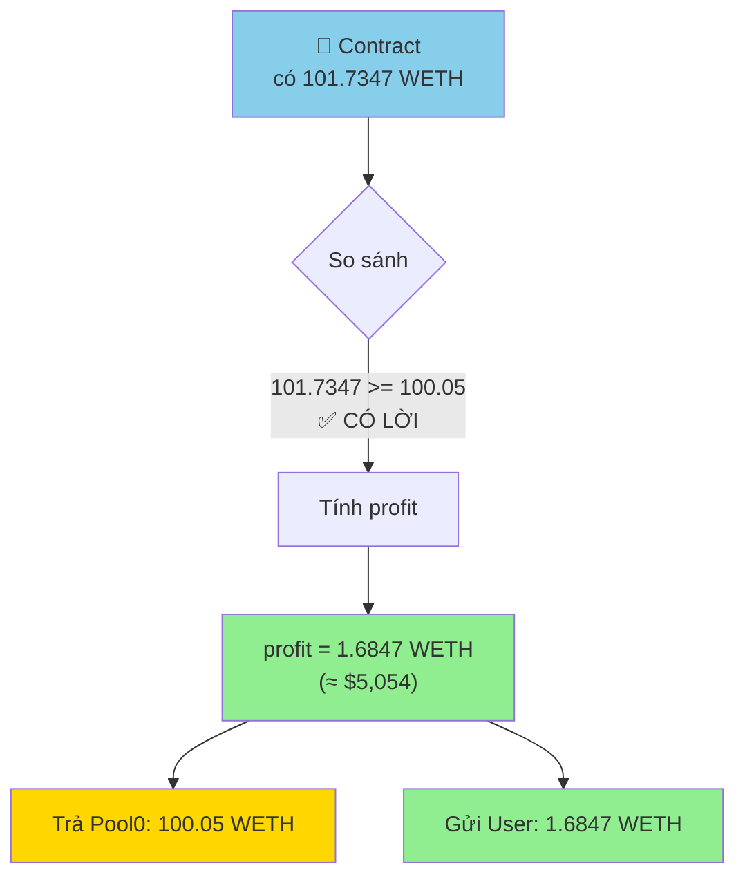
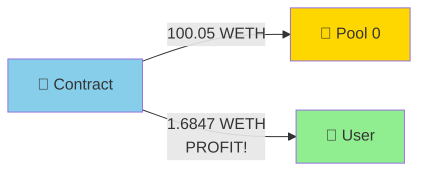

# VÍ DỤ ĐơN GIẢN NHẤT - ARBITRAGE FLOW

## 🎯 Tình huống: Kiếm lời từ chênh lệch giá

```
Pool 0 (phí thấp 0.05%):  1 WETH = 3000 USDC
Pool 1 (phí cao 0.3%):    1 WETH = 2940 USDC  ← GIÁ RẺ HƠN!
```

**Ý tưởng**: Vay WETH từ Pool 0, đổi sang USDC, dùng USDC mua WETH rẻ hơn ở Pool 1, trả nợ Pool 0 và giữ phần chênh lệch!

---

## 📊 FLOW STEP BY STEP

### **STEP 0: Chuẩn bị**

```javascript
// User có sẵn một ít WETH để cover loss nếu có
const userWETH = "10 WETH"

// Deploy contract
const contract = await deploy("UniswapV3FlashSwap");
```

---

### **STEP 1: User gọi flashSwap() 🚀**

```javascript
// User gọi với tham số:
contract.flashSwap(
    "0x88e6...5640",  // ← pool0 address (USDC/WETH 0.05% fee)
    3000,             // ← fee1 (pool1 có phí 0.3%)
    "100 WETH"        // ← Số lượng muốn arbitrage
);
```



**Console log:**
```
🟢 User calls flashSwap with 100 WETH
```

---

### **STEP 2: Contract vay WETH từ Pool0 📤**

Contract encode data và gọi `pool0.swap()`:

```javascript
// Bên trong contract:
bytes memory data = abi.encode(
    msg.sender,  // 0x1234...User
    pool0,       // 0x88e6...5640
    fee1         // 3000
);

IUniswapV3Pool(pool0).swap(
    address(this),      // gửi token về contract
    false,              // false = WETH → USDC
    100 WETH,           // vay 100 WETH
    MAX_SQRT_RATIO - 1,
    data
);
```



**Pool0 tính toán:**

```
Vay: 100 WETH
Giá Pool0: 1 WETH = 3000 USDC
Phí Pool0: 0.05%

→ Pool0 gửi cho contract: 100 × 3000 = 300,000 USDC
→ Contract phải trả:       100 × 1.0005 = 100.05 WETH
```

**Console log:**
```
🟡 Pool0 sends: 300,000 USDC
🟡 Contract owes: 100.05 WETH (100 + 0.05% fee)
```

---

### **STEP 3: Pool0 gọi callback 📞**

Pool0 gọi `uniswapV3SwapCallback()` trên contract:

```javascript
// Pool0 gọi:
contract.uniswapV3SwapCallback(
    -300_000_000000,           // amount0 (USDC, số âm = gửi ra)
    100_050000000000000000,    // amount1 (WETH phải trả)
    data                       // data đã encode ở step 2
);
```



**Contract nhận được:**

```javascript
// Bên trong callback:
amount0 = -300,000 USDC  // âm = contract nhận
amount1 = +100.05 WETH   // dương = contract phải trả

usdcAmountOut = 300,000 USDC  // uint(-amount0)
wethAmountIn = 100.05 WETH    // uint(amount1)
```

**Console log:**
```
🟢 Callback received!
🟢 Contract has: 300,000 USDC
🟢 Must pay back: 100.05 WETH
```

---

### **STEP 4: Contract swap USDC → WETH qua Pool1 🔄**

```javascript
// Contract gọi _swap():
uint wethAmountOut = _swap(
    USDC,          // tokenIn
    WETH,          // tokenOut
    3000,          // fee 0.3%
    300_000 USDC   // amountIn
);
```



**Pool1 tính toán:**

```
Swap: 300,000 USDC → WETH
Giá Pool1: 1 WETH = 2940 USDC (RẺ HƠN Pool0!)
Phí Pool1: 0.3%

Bước 1: WETH trước phí = 300,000 ÷ 2940 = 102.0408 WETH
Bước 2: Trừ phí 0.3%    = 102.0408 × (1 - 0.003) = 102.0408 × 0.997
                        = 101.7347 WETH

→ wethAmountOut = 101.7347 WETH
```

**Console log:**
```
🔵 Swapping 300,000 USDC → WETH via Pool1...
🔵 Received: 101.7347 WETH
```

---

### **STEP 5: Tính profit và phân phối 💰**

```javascript
// So sánh:
wethAmountOut = 101.7347 WETH  // Nhận từ Pool1
wethAmountIn = 100.05 WETH     // Phải trả Pool0

if (wethAmountOut >= wethAmountIn) {
    // ✅ CÓ LỜI!
    profit = wethAmountOut - wethAmountIn;
    // = 101.7347 - 100.05
    // = 1.6847 WETH

    // Trả nợ Pool0
    weth.transfer(pool0, wethAmountIn);  // 100.05 WETH

    // Gửi profit cho User
    weth.transfer(caller, profit);       // 1.6847 WETH
}
```



**Console log:**
```
✅ PROFIT DETECTED!
✅ Profit: 1.6847 WETH (≈ $5,054)
✅ Paying back Pool0: 100.05 WETH
✅ Sending profit to user: 1.6847 WETH
```

---

### **STEP 6: Hoàn tất ✅**



**Final balance:**

```
User ban đầu:  3000 WETH
User approve:  -100 WETH (để cover nếu loss)
User nhận:     +1.6847 WETH (profit!)
User còn lại:  2901.6847 WETH

Pool0: Nhận lại 100.05 WETH (hòa vốn + phí)
Pool1: Nhận 300,000 USDC, trả 101.7347 WETH (kiếm phí 0.3%)
Contract: 0 WETH (đã chuyển hết)
```

**Console log:**
```
🎉 ARBITRAGE COMPLETED!
🎉 User profit: 1.6847 WETH (≈ $5,054 USD)
```

---

## 📋 BẢNG TỔNG HỢP FLOW

| Step | Actor | Action | Input | Output | Balance Change |
|------|-------|--------|-------|--------|----------------|
| 1 | User | Call flashSwap() | 100 WETH | - | -100 WETH (approved) |
| 2 | Contract | Call pool0.swap() | Vay 100 WETH | 300,000 USDC | +300k USDC, owe 100.05 WETH |
| 3 | Pool0 | Callback | -300k USDC | Call callback | -300k USDC |
| 4 | Contract | Swap via Pool1 | 300k USDC | 101.7347 WETH | -300k USDC, +101.7347 WETH |
| 5 | Contract | Pay Pool0 | 100.05 WETH | - | -100.05 WETH |
| 6 | Contract | Send profit | 1.6847 WETH | - | -1.6847 WETH |
| ✅ | User | Receive | - | 1.6847 WETH | +1.6847 WETH PROFIT! |

---

## 🔥 CODE ĐƠN GIẢN NHẤT

```javascript
// 1. Deploy contract
const contract = await deploy("UniswapV3FlashSwap");

// 2. Approve WETH
await weth.approve(contract.address, ethers.utils.parseEther("100"));

// 3. Call flashSwap - DỄ DÀNG!
await contract.flashSwap(
    "0x88e6A0c2dDD26FEEb64F039a2c41296FcB3f5640",  // pool0
    3000,                                          // fee1
    ethers.utils.parseEther("100")                 // 100 WETH
);

// 4. Kiểm tra profit
const balance = await weth.balanceOf(myAddress);
console.log("Profit:", ethers.utils.formatEther(balance));
// Output: Profit: 1.6847
```

---

## 🎯 ĐIỂM QUAN TRỌNG

### **1. Tham số gọi hàm:**

```javascript
flashSwap(
    pool0,        // Pool để vay (thường là pool phí THẤP)
    fee1,         // Phí của pool kia (để swap)
    wethAmount    // Số WETH muốn arbitrage
)
```

### **2. Luồng tiền:**

```
User → Contract → Pool0 (vay) → Contract (nhận USDC) → Router → Pool1 (swap)
→ Contract (nhận WETH) → Pool0 (trả nợ) → User (nhận profit)
```

### **3. Công thức profit:**

```
Profit = (Pool1_Output × Pool1_Rate × (1 - Pool1_Fee))
         - (Borrow_Amount × (1 + Pool0_Fee))

Với ví dụ trên:
= (300,000 / 2940) × 0.997 - 100 × 1.0005
= 101.7347 - 100.05
= 1.6847 WETH ✅
```

---

## 🚀 TÓM TẮT 3 DÒNG

```javascript
// 1. Vay rẻ từ Pool0
flashSwap(pool0, fee1, 100 WETH)

// 2. Swap sang Pool1 có giá tốt hơn
// (tự động trong callback)

// 3. Nhận profit!
// 1.6847 WETH ≈ $5,054 USD 🎉
```

**VẬY LÀ XEM!** 🎯
